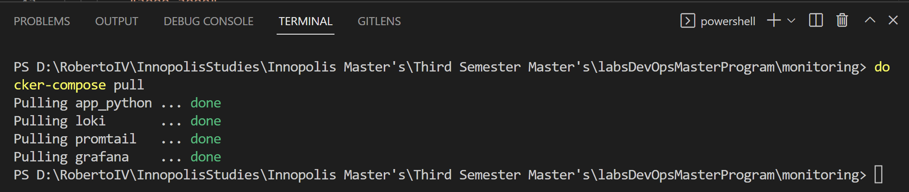
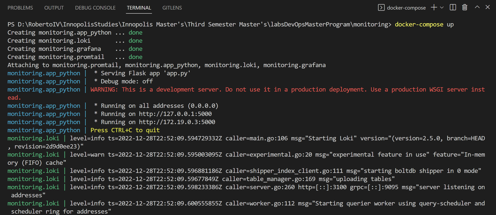
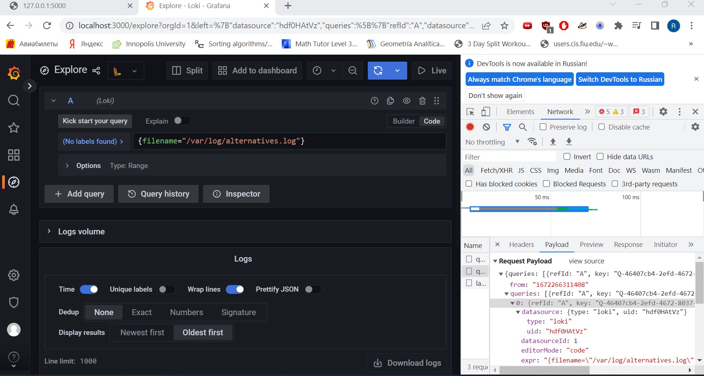

# Logging stack, Promtail, Loki, Grafana.

## Best practices

- Implement Structured Logging
- Build Meaning and Context into Log Messages
- Avoid Logging Non-essential or Sensitive Data
- Capture Logs from Diverse Sources
- Aggregate and Centralize Your Log Data
- Index Logs for Querying and Analytics
- Configure Real-Time Log Monitoring and Alerts
- Optimize Your Log Retention Policy

### Graphana Dashboard
- Avoid dashboard sprawl, meaning the uncontrolled growth of dashboards. Dashboard sprawl negatively affects time to find the right dashboard. Duplicating dashboards and changing “one thing” (worse: keeping original tags) is the easiest kind of sprawl.
- Periodically review the dashboards and remove unnecessary ones.
- Copying dashboards with no significant changes is not a good idea.
- When you have to copy a dashboard, clearly rename it and do not copy the dashboard tags. 
- Maintain a dashboard of dashboards or cross-reference dashboards. This can be done in several ways:
    * Create dashboard links, panel, or data links. Links can go to other dashboards or to external systems.
    * Add a Dashboard list panel. You can then customize what you see by doing tag or folder searches.
    * Add a Text panel and use markdown to customize the display.

## Report screenshots.

### Docker compose pull.

### Docker compose deployment.

### Grafana interface.

### App running.

.png)
