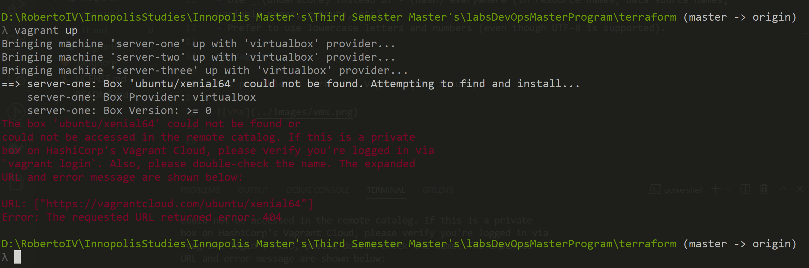
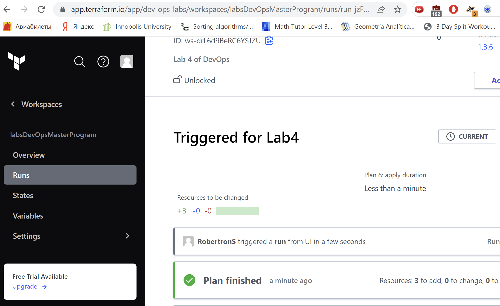
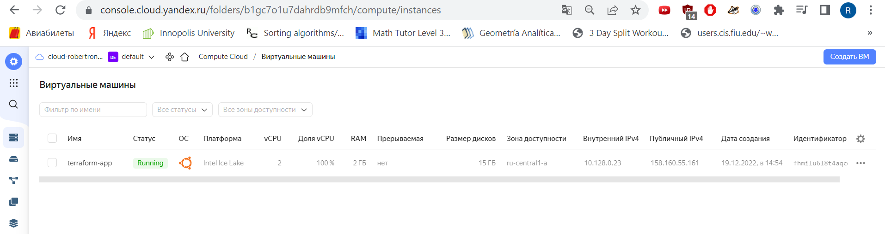

## Best practices for Terraform

- Dont't change terraform state file (.tfstate) manually, it is better to do this by using "apply" command
- Set up a shared remote storage
- Backup state file
- Use 1 state file per Environment (test, dev, or production)
- Use CI for terraform code
- Generate README for each module with input and output variables
- Update terraform version
- Terraform version manager
- Run terraform in docker container

### About Naming Conventions:

- Use _ (underscore) instead of - (dash) everywhere (in resource names, data source names, variable names, outputs, etc).
- Prefer to use lowercase letters and numbers (even though UTF-8 is supported).

## Vagrant.

Not possible to work with vagrant (VPN issues)

## Terraform WorkSpace

## Yandex Cloud VM

