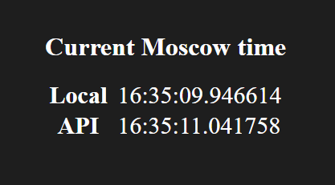

[](https://github.com/MrTuxedoCrab/Ilya-Nokhrin-labs/actions/workflows/ci.yml)
# Labs for Innopolis DevOps Engineering Summer 2022 Course

## Getting Started

These instructions will get you a copy of the project up and running on your local machine for development and testing purposes.

### Prerequisites

* Python3 (versions 3.8+ recommended)
* Packages specified in requirements.txt

### Installing

1. Clone the repository
2. Set `main.py` as a flask app file:

```
export FLASK_APP=app_python/main.py
```

3. Set development mode in flask:

```
export FLASK_ENV=development
```

4. Run flask:

```
flask run
```

5. In browser, open 127.0.0.1:5000 (or localhost:5000)

6. If previous steps are performed successfully, you should see this data



## Running the tests

To run the tests, execute appropriate `*_tests.py` file. For example, to test `get_time.py` run following command:

```
python3 .\get_time_tests.py
```

### Expected response

This response will be provide if all tests in current version of `get_time_tests.py` run successfully

```
python3 .\get_time_tests.py
..
----------------------------------------------------------------------
Ran 2 tests in 2.515s

OK
```

### Example of failed test response

This response will be provided if API accessibility test fails

```
 python3 .\get_time_tests.py
.F
======================================================================
FAIL: test__get_moscow_time_api__api_responds (__main__.TestLexer)
----------------------------------------------------------------------
Traceback (most recent call last):
  File ".\get_time_tests.py", line 9, in test__get_moscow_time_api__api_responds
    self.assertFalse(res.ok, "API is not responding")
AssertionError: True is not false : API is not responding

----------------------------------------------------------------------
Ran 2 tests in 0.349s

FAILED (failures=1)
```

## Test description

### `get_time_tests.py`

#### `test__get_moscow_time_api__api_responds`

* Tested methods: None (accessibility test of external API)
* Performed actions: request is performed to `http://worldtimeapi.org/api/timezone/Europe/Moscow`
* Expected result: request returns with `request.ok` flag set to `True` (request was handled successfully)

#### `test__api_and_local_get_time__time_diff_less_than_2s`

* Tested methods: `get_moscow_time`, `get_moscow_time_api`
* Performed actions: both methods are executed, returned timestamps are compared
* Expected result: difference between timestamps is less than 2 seconds (in any direction)

## Docker

Docker image is [hosted on docker hub](https://hub.docker.com/r/ilyanokhrin/app-python).

### Build image

```
docker build -t ilyanokhrin/app-python .
```

### Run docker

```
docker run -p 5000:5000 ilyanokhrin/app-python
```

### Expected output

If everything is performed successfully, you should see following output:

```
docker run -p 5000:5000 ilyanokhrin/app-python
 * Serving Flask app 'main.py' (lazy loading)
 * Environment: development
 * Debug mode: on
 * Running on all addresses (0.0.0.0)
   WARNING: This is a development server. Do not use it in a production deployment.
 * Running on http://127.0.0.1:5000
 * Running on http://172.17.0.2:5000 (Press CTRL+C to quit)
 ```

 After that, page can be accessed on [port 5000 of localhost](http://127.0.0.1:5000)

## Built With

* [pytz](https://pypi.org/project/pytz/) - Olson tz database to get timezone from location
* [requests](https://requests.readthedocs.io/en/master/) - Lightweight request library to handle API communication
* [Flask](https://flask.palletsprojects.com/en/2.1.x/) - Chosen framework

Reasons to use Flask:

* **It's popular**: Flask is one of the most popular web frameworks for Python. Because of that, it has an extensive amount of code examples and thorough documentation, as well as active community.
* **It's modular**: Flask supports wide variety of modules, which can be used to extend basic Flask functionality.
* **It's lightweight**: As a consequence of its modularity, Flask only comes with basic functionality built-in and is very lightweight as a result.

## Authors

* **Ilya Nokhrin** - [Telegram](https://t.me/IlyaNokhrin) - [Innopolis Mail](mailto:i.nokhrin@innopolis.university)

## License

This project is licensed under the MIT License - see the [LICENSE.md](LICENSE.md) file for details

## Acknowledgements

* [Template used](https://gist.github.com/PurpleBooth/109311bb0361f32d87a2)
