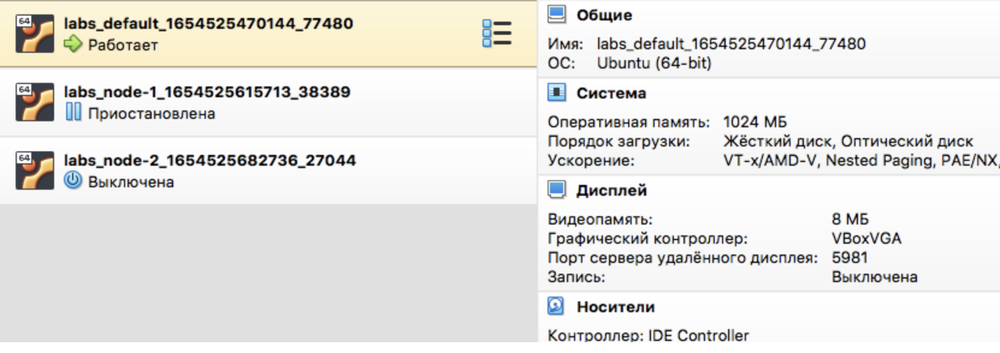
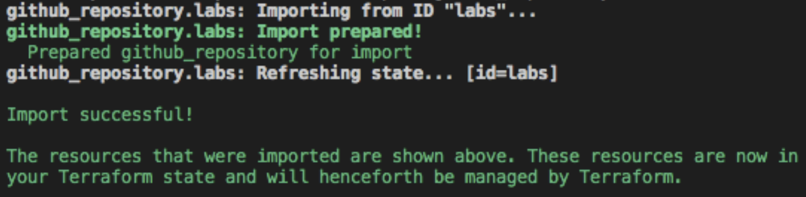

## Best Practices for Terraform

1. Don’t commit the .tfstate file
2. Configure a backend
3. Back up your state files
4. Keep your backends small
5. Use one state per environment
6. Setup backend state locking
7. Execute Terraform in an automated build
8. Manipulate state only through the commands
9. Use variables
10. Do not hardcode secrets

### 3 VMs:

### TerraformGithub:

