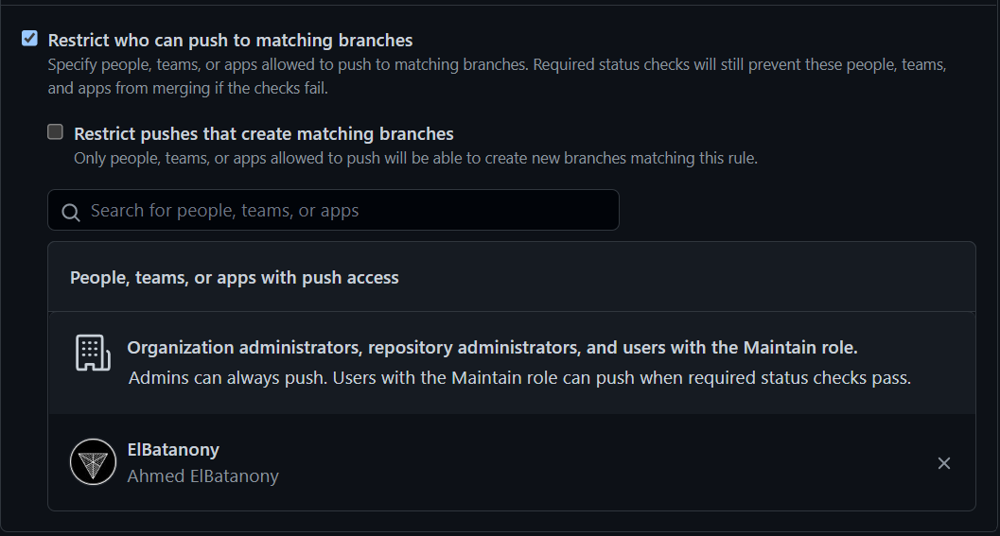

# Terraform Best Practices

Source: [Terraform Best Practices Repository](https://github.com/ozbillwang/terraform-best-practices) by [Bill Wang](https://github.com/ozbillwang).

- Run terraform command with var-file
  - to avoid running terraform with long list of key-value pairs
- Enable version control on terraform state files bucket
  - Always set backend to s3 and enable version control on this bucket.
- Manage multiple Terraform modules and environments easily with Terragrunt
  - Terragrunt is a thin wrapper for Terraform that provides extra tools for working with multiple Terraform modules.
- Turn on debug when you need do troubleshooting
  - `TF_LOG=DEBUG terraform <command>`
- Use shared modules
  - Manage terraform resource with shared modules, this will save a lot of coding time.
- Isolate environments
  - create resources with different name for each environment and each resource
- Use terraform import to include as many resources you can
- Avoid hard coding the resources
  - Use data sources
- Validate and format terraform code
  - Always run `terraform fmt` to format terraform configuration files
- Generate README for each module with input and output variables
  - A tool named `terraform-docs` can do the job for you
- Terraform version manager
  - You can manage multiple terraform versions with `tfenv`

## Running `plan` and `apply`

To use the Terraform commands without pasting the environment/secret variables everytime,

add `github_token="secret_token"` to `secret.tfvars` file,

and run `terraform plan -var-file="secret.tfvars"` or `terraform apply -var-file="secret.tfvars"`

## Screenshots

[GitHub repo link](https://github.com/elbatanony-devops/devops-terraform)

### Vagrant with 3 VMs running in Virtual Box

### Default Branch (by Terraform Config)

### Branch Protection (by Terraform Config)

### BONUS: Organization teams with members invitations (by Terraform Config)

