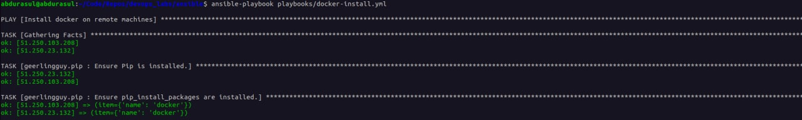
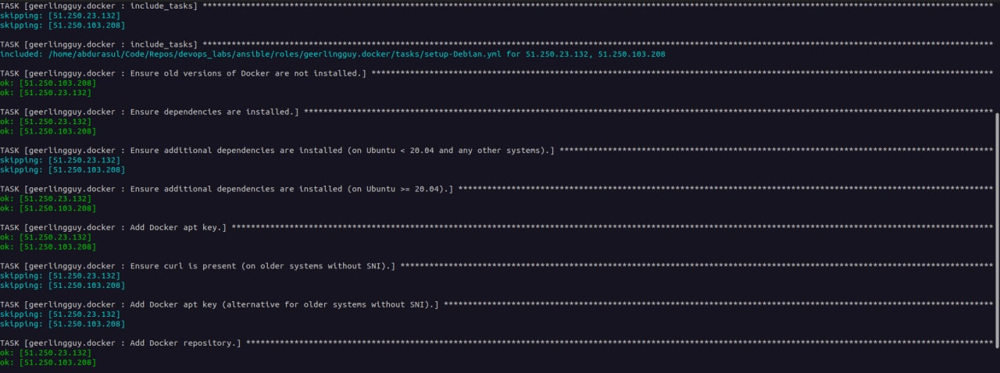
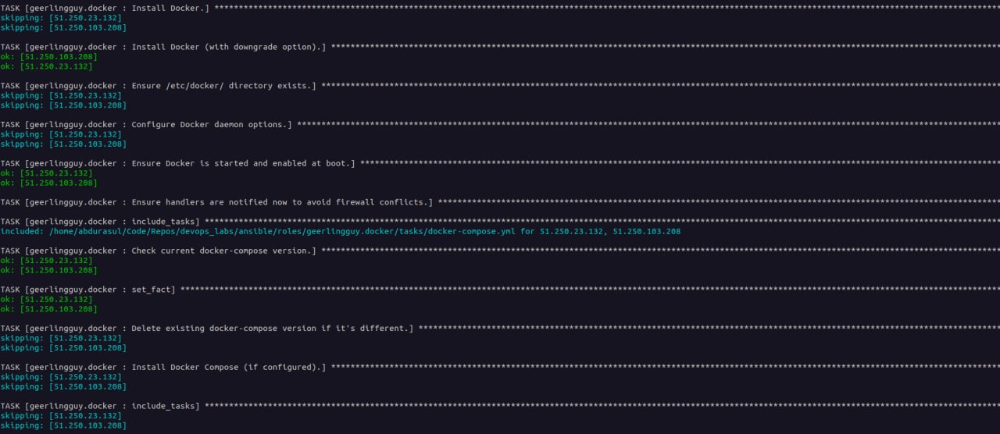
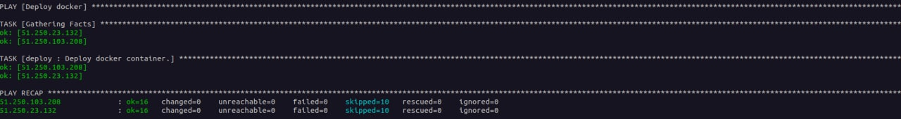
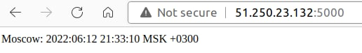

# Ansible configuration

For installing pip and docker and also python package for docker, I used geerlingguy from ansible-galaxy.
The third role is for deploying the docker image to the servers.

Note: the screenshots are given after running ansible several times. Therefore there it doesn't contain notes like 'changed' (it was changed in previous run).

# Screenshots
Here are the screenshots from ansible run

# Pip installation

# Docker installation

# Deployment

# Running example from browser
