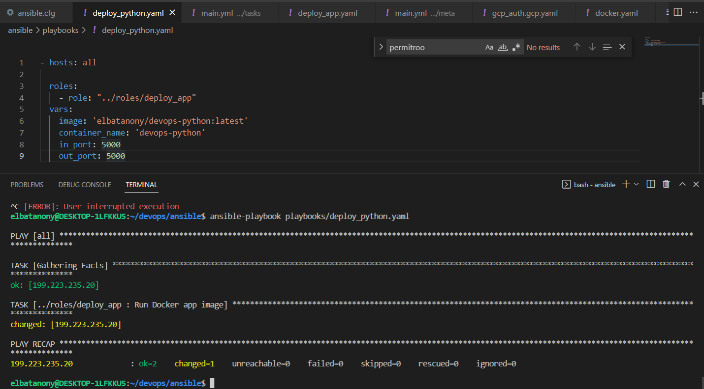
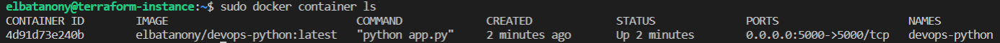

# Ansible

To run the playbook, run `ansible-playbook playbooks/docker.yaml`

## Resources

Used the [geerlingguy.docker](https://github.com/geerlingguy/ansible-role-docker) role, installed from Ansible Galaxy.

```Shell
ansible-galaxy install geerlingguy.docker
```

Note that for lab 5, no roles file is present since the only role used is from Ansible Galaxy. The downloaded files are not included in the repo.

## Screenshots


### Running the playbook to deploy Python app (Docker)



### Docker container running in Cloud VM after playbook


