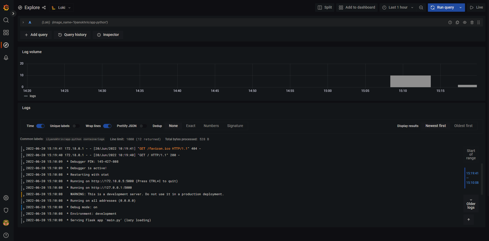

# Best practices for logging

## Loki
1. Use dynamic labels sparingly; **prioritize** using **static labels** where possible
2. Assure that **label values are bounded**
3. **Configure** Loki (caching, time ordering, etc.)
4. Use `chunk_target_size`
5. Use `-print-config-stderr` or `-log-config-reverse-order`

## Graphana Dashboard
- **Avoid dashboard sprawl**, meaning the uncontrolled growth of dashboards. Dashboard sprawl negatively affects time to find the right dashboard. Duplicating dashboards and changing “one thing” (worse: keeping original tags) is the easiest kind of sprawl.
    - **Periodically review the dashboards** and remove unnecessary ones.
    - If you create a **temporary dashboard**, perhaps to test something, **prefix the name with TEST:**. Delete the dashboard when you are finished.
- **Copying** dashboards **with no significant changes** is **not a good idea**.
    - You miss out on updates to the original dashboard, such as documentation changes, bug fixes, or additions to metrics.
    - In many cases copies are being made to simply customize the view by setting template parameters. This should instead be done by maintaining a link to the master dashboard and customizing the view with URL parameters.
- **When you must copy a dashboard, clearly rename it and do not copy the dashboard tags**. Tags are important metadata for dashboards that are used during search. Copying tags can result in false matches.
- **Maintain a dashboard of dashboards** or cross-reference dashboards. This can be done in several ways:
    - **Create dashboard links, panel, or data links**. Links can go to other dashboards or to external systems.
    - **Add a Dashboard list panel**. You can then customize what you see by doing tag or folder searches.
    - **Add a Text panel** and use markdown to customize the display.

Based on [Graphana labs documentation](https://grafana.com/docs/grafana/latest/best-practices/best-practices-for-managing-dashboards/)

# Report screenshot

