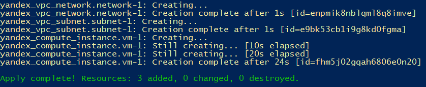
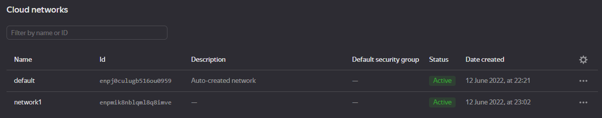
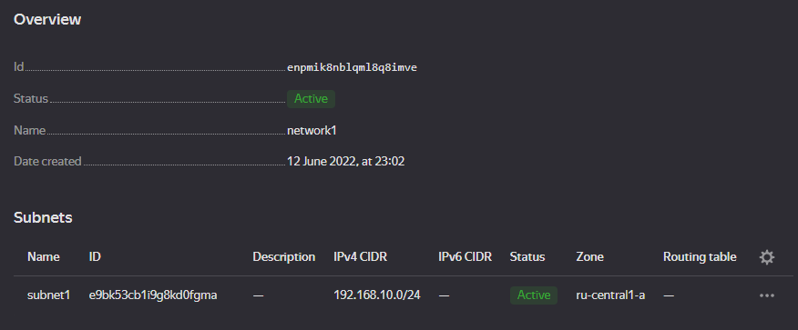
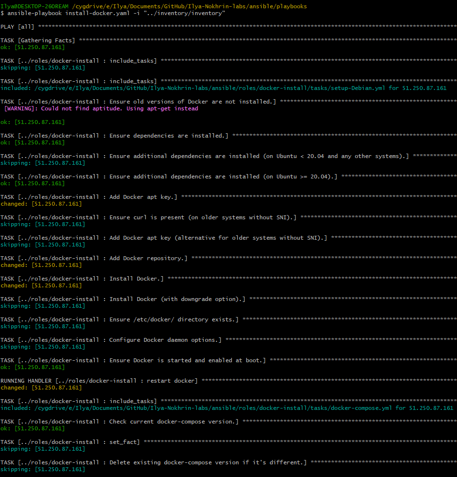
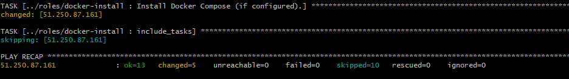

## Best practices for Terraform

- Do not store any secret data directly in files
- Store access tokens and secrets as environment variables
- Authenticate with SSH instead of login/password
- Output variable to know the IP address of endpoint

## Screenshots

### Lab 5

