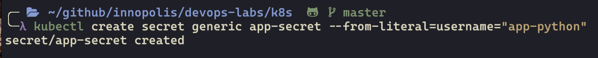
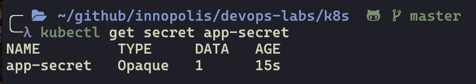
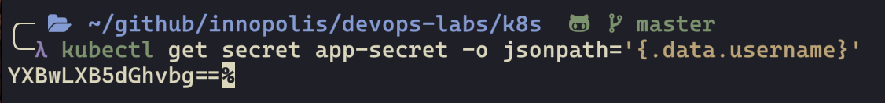
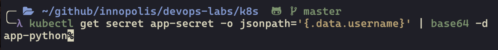
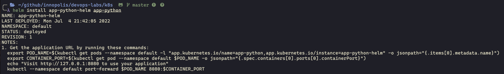
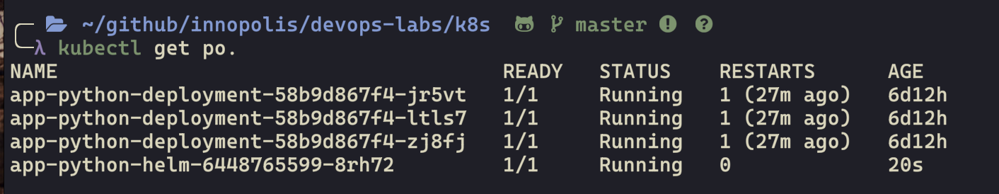
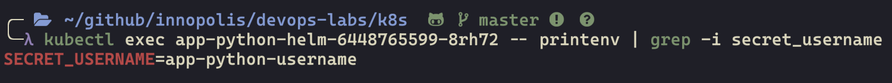
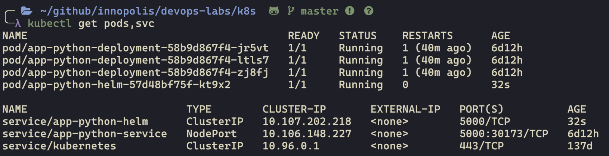
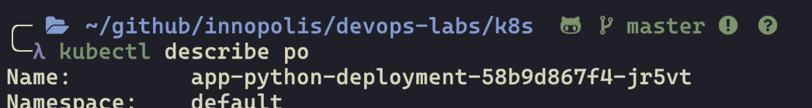
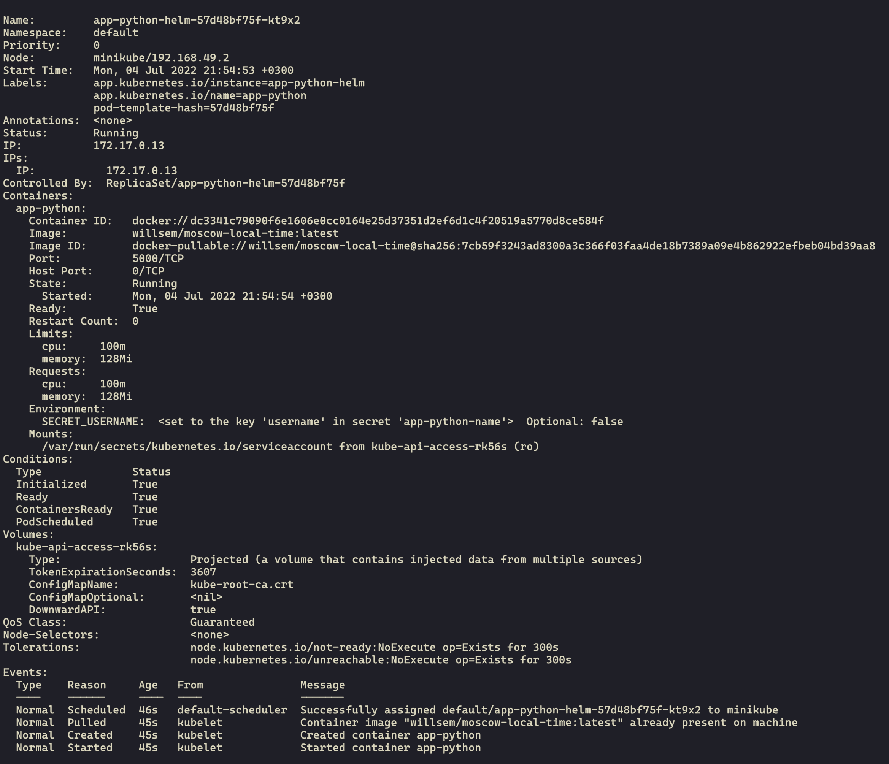

# Lab 11

## Create a secret

## Verification and decoding

### Get secret

### Get the value

### Decode the value

## Helm

### Start helm

### Get pods

### Check secrets

## Setup limits

### Get pods,svc

### Get pod description

