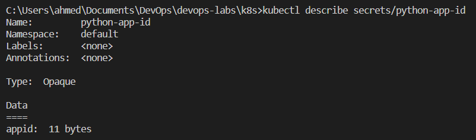
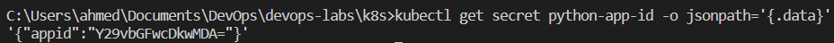
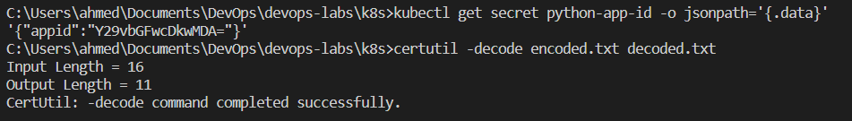
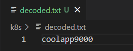
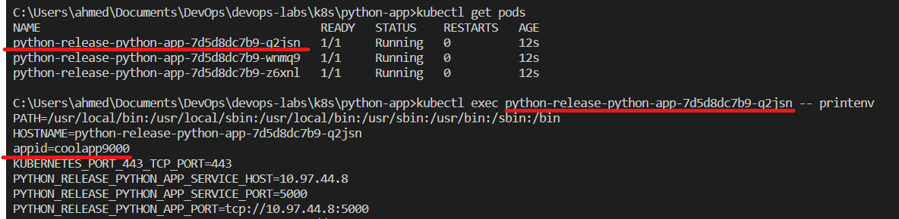
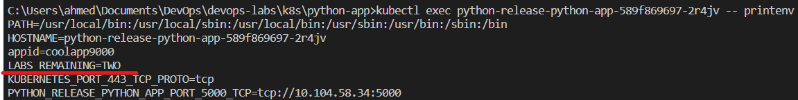

# Lab 11

## Notes

I changed the secret name from python-app-id midway through the lab for app-id for ease of use, and reusability with bonus project.

I used the `certutil` command on Windows to decode the secret.

## Screenshots

### Verifying secret

Describe secret

Get secret

### Decoding secret

Decode command

Result, i.e., decoded file

### Environment variable present in pod

## Bonus

### Environment Variable

