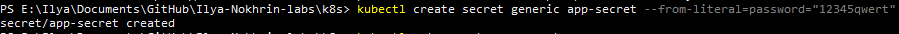
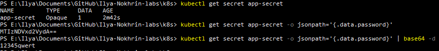
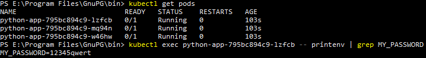
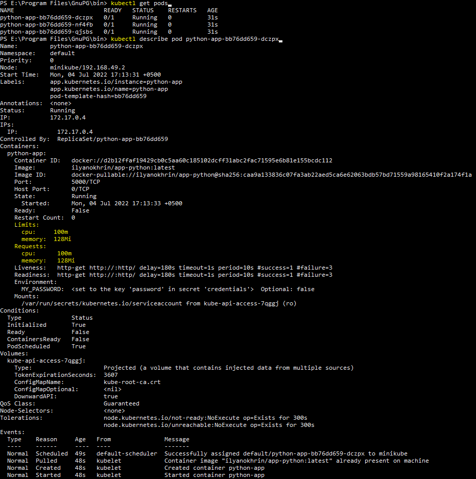

# Screenshots for lab 11

1. Adding a secret via kubectl

2. Viewing and decoding secret

3. Viewing a secret created via helm secret

4. Limits and requests (relevant data is highlighted in yellow). Also shows MY_PASSWORD in environment

