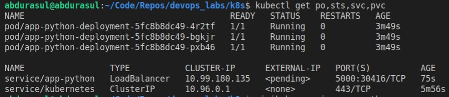

# Result of running `helm install --dry-run --debug app-python ./app-python-0.1.0.tgz`
```
install.go:178: [debug] Original chart version: ""
install.go:195: [debug] CHART PATH: /home/abdurasul/Code/Repos/devops_labs/k8s/app-python-0.1.0.tgz

NAME: app-python
LAST DEPLOYED: Sun Jul 24 15:36:28 2022
NAMESPACE: default
STATUS: pending-install
REVISION: 1
USER-SUPPLIED VALUES:
{}

COMPUTED VALUES:
affinity: {}
autoscaling:
  enabled: false
  maxReplicas: 100
  minReplicas: 1
  targetCPUUtilizationPercentage: 80
fullnameOverride: ""
image:
  pullPolicy: IfNotPresent
  repository: megara/devops-app-python
  tag: latest
imagePullSecrets: []
ingress:
  annotations: {}
  className: ""
  enabled: false
  hosts:
  - host: chart-example.local
    paths:
    - path: /
      pathType: ImplementationSpecific
  tls: []
nameOverride: ""
nodeSelector: {}
podAnnotations: {}
podSecurityContext: {}
replicaCount: 1
resources: {}
securityContext: {}
service:
  port: 80
  type: ClusterIP
serviceAccount:
  annotations: {}
  create: true
  name: ""
tolerations: []

HOOKS:
---
# Source: app-python/templates/tests/test-connection.yaml
apiVersion: v1
kind: Pod
metadata:
  name: "app-python-test-connection"
  labels:
    helm.sh/chart: app-python-0.1.0
    app.kubernetes.io/name: app-python
    app.kubernetes.io/instance: app-python
    app.kubernetes.io/version: "1.16.0"
    app.kubernetes.io/managed-by: Helm
  annotations:
    "helm.sh/hook": test
spec:
  containers:
    - name: wget
      image: busybox
      command: ['wget']
      args: ['app-python:80']
  restartPolicy: Never
MANIFEST:
---
# Source: app-python/templates/serviceaccount.yaml
apiVersion: v1
kind: ServiceAccount
metadata:
  name: app-python
  labels:
    helm.sh/chart: app-python-0.1.0
    app.kubernetes.io/name: app-python
    app.kubernetes.io/instance: app-python
    app.kubernetes.io/version: "1.16.0"
    app.kubernetes.io/managed-by: Helm
---
# Source: app-python/templates/config.yaml
apiVersion: v1
kind: ConfigMap
metadata:
    name: app-python-configmap
    labels:
      app: app-python
      chart: app-python-0.1.0
data:
  config.json:
    '{
    "data": "somedata"
}'
---
# Source: app-python/templates/service.yaml
apiVersion: v1
kind: Service
metadata:
  name: app-python
  labels:
    helm.sh/chart: app-python-0.1.0
    app.kubernetes.io/name: app-python
    app.kubernetes.io/instance: app-python
    app.kubernetes.io/version: "1.16.0"
    app.kubernetes.io/managed-by: Helm
spec:
  type: ClusterIP
  ports:
    - port: 80
      targetPort: http
      protocol: TCP
      name: http
  selector:
    app.kubernetes.io/name: app-python
    app.kubernetes.io/instance: app-python
---
# Source: app-python/templates/statefulset.yaml
apiVersion: apps/v1
kind: StatefulSet
metadata:
  name: app-python
  labels:
    helm.sh/chart: app-python-0.1.0
    app.kubernetes.io/name: app-python
    app.kubernetes.io/instance: app-python
    app.kubernetes.io/version: "1.16.0"
    app.kubernetes.io/managed-by: Helm
spec:
  serviceName: app-python
  replicas: 1
  selector:
    matchLabels:
      app.kubernetes.io/name: app-python
      app.kubernetes.io/instance: app-python
  template:
    metadata:
      labels:
        app.kubernetes.io/name: app-python
        app.kubernetes.io/instance: app-python
    spec:
      serviceAccountName: app-python
      volumes:
        - name: config-volume
          configMap:
            name: app-python-configmap   
      securityContext:
        {}
      containers:
        - name: app-python
          securityContext:
            {}
          image: "megara/devops-app-python:latest"
          imagePullPolicy: IfNotPresent
          # env:
          #   - name: MY_PASSWORD
          #     valueFrom:
          #       secretKeyRef:
          #         name: credentials
          #         key: password
          volumeMounts:
            - name: config-volume
              mountPath: /files/config.json
              subPath: config.json
          ports:
            - name: http
              containerPort: 5000
              protocol: TCP
          livenessProbe:
            httpGet:
              path: /
              port: http
          readinessProbe:
            httpGet:
              path: /
              port: http
          resources:
            {}
```

# Result of running `kubectl get po,sts,svc,pvc`:


# (Pod 3) Result of running `kubectl exec pod/app-python-deployment-5fc8b8dc49-pxb46  -- cat /app/logs.txt`
```
INFO:werkzeug: * Running on all addresses (0.0.0.0)
   WARNING: This is a development server. Do not use it in a production deployment.
 * Running on http://127.0.0.1:5000
 * Running on http://172.17.0.3:5000 (Press CTRL+C to quit)
DEBUG:root:main function called :2022-07-24 15:48:42.312675+03:00
INFO:werkzeug:172.17.0.1 - - [24/Jul/2022 12:48:42] "GET / HTTP/1.1" 200 -
DEBUG:root:main function called :2022-07-24 15:48:42.657179+03:00
INFO:werkzeug:172.17.0.1 - - [24/Jul/2022 12:48:42] "GET / HTTP/1.1" 200 -
DEBUG:root:main function called :2022-07-24 15:48:42.920965+03:00
INFO:werkzeug:172.17.0.1 - - [24/Jul/2022 12:48:42] "GET / HTTP/1.1" 200 -
DEBUG:root:main function called :2022-07-24 15:48:43.046764+03:00
INFO:werkzeug:172.17.0.1 - - [24/Jul/2022 12:48:43] "GET / HTTP/1.1" 200 -
DEBUG:root:main function called :2022-07-24 15:48:43.656724+03:00
INFO:werkzeug:172.17.0.1 - - [24/Jul/2022 12:48:43] "GET / HTTP/1.1" 200 -
DEBUG:root:main function called :2022-07-24 15:49:51.391076+03:00
INFO:werkzeug:172.17.0.1 - - [24/Jul/2022 12:49:51] "GET / HTTP/1.1" 200 -
DEBUG:root:main function called :2022-07-24 15:49:58.671546+03:00
INFO:werkzeug:172.17.0.1 - - [24/Jul/2022 12:49:58] "GET / HTTP/1.1" 200 -
DEBUG:root:main function called :2022-07-24 15:49:59.040537+03:00
INFO:werkzeug:172.17.0.1 - - [24/Jul/2022 12:49:59] "GET / HTTP/1.1" 200 -
DEBUG:root:main function called :2022-07-24 15:49:59.138757+03:00
INFO:werkzeug:172.17.0.1 - - [24/Jul/2022 12:49:59] "GET / HTTP/1.1" 200 -
DEBUG:root:main function called :2022-07-24 15:49:59.259023+03:00
INFO:werkzeug:172.17.0.1 - - [24/Jul/2022 12:49:59] "GET / HTTP/1.1" 200 -
DEBUG:root:main function called :2022-07-24 15:49:59.536575+03:00
INFO:werkzeug:172.17.0.1 - - [24/Jul/2022 12:49:59] "GET / HTTP/1.1" 200 -
DEBUG:root:main function called :2022-07-24 15:49:59.718523+03:00
INFO:werkzeug:172.17.0.1 - - [24/Jul/2022 12:49:59] "GET / HTTP/1.1" 200 -
DEBUG:root:main function called :2022-07-24 15:50:00.562905+03:00
INFO:werkzeug:172.17.0.1 - - [24/Jul/2022 12:50:00] "GET / HTTP/1.1" 200 -
DEBUG:root:main function called :2022-07-24 15:50:00.936054+03:00
INFO:werkzeug:172.17.0.1 - - [24/Jul/2022 12:50:00] "GET / HTTP/1.1" 200 -
DEBUG:root:main function called :2022-07-24 15:50:01.627681+03:00
INFO:werkzeug:172.17.0.1 - - [24/Jul/2022 12:50:01] "GET / HTTP/1.1" 200 -
DEBUG:root:main function called :2022-07-24 15:50:01.744889+03:00
INFO:werkzeug:172.17.0.1 - - [24/Jul/2022 12:50:01] "GET / HTTP/1.1" 200 -
DEBUG:root:main function called :2022-07-24 15:50:02.023942+03:00
INFO:werkzeug:172.17.0.1 - - [24/Jul/2022 12:50:02] "GET / HTTP/1.1" 200 -
DEBUG:root:main function called :2022-07-24 15:50:02.558592+03:00
INFO:werkzeug:172.17.0.1 - - [24/Jul/2022 12:50:02] "GET / HTTP/1.1" 200 -
DEBUG:root:main function called :2022-07-24 15:50:09.018488+03:00
INFO:werkzeug:172.17.0.1 - - [24/Jul/2022 12:50:09] "GET / HTTP/1.1" 200 -
```


# (Pod 2) Result of running `kubectl exec pod/app-python-deployment-5fc8b8dc49-bgkjr  -- cat /app/logs.txt`
```
INFO:werkzeug: * Running on all addresses (0.0.0.0)
   WARNING: This is a development server. Do not use it in a production deployment.
 * Running on http://127.0.0.1:5000
 * Running on http://172.17.0.4:5000 (Press CTRL+C to quit)
INFO:werkzeug:172.17.0.1 - - [24/Jul/2022 12:48:35] "GET /favicon.ico HTTP/1.1" 404 -
DEBUG:root:main function called :2022-07-24 15:48:42.038018+03:00
INFO:werkzeug:172.17.0.1 - - [24/Jul/2022 12:48:42] "GET / HTTP/1.1" 200 -
DEBUG:root:main function called :2022-07-24 15:48:42.535069+03:00
INFO:werkzeug:172.17.0.1 - - [24/Jul/2022 12:48:42] "GET / HTTP/1.1" 200 -
DEBUG:root:main function called :2022-07-24 15:48:43.521341+03:00
INFO:werkzeug:172.17.0.1 - - [24/Jul/2022 12:48:43] "GET / HTTP/1.1" 200 -
DEBUG:root:main function called :2022-07-24 15:48:43.836975+03:00
INFO:werkzeug:172.17.0.1 - - [24/Jul/2022 12:48:43] "GET / HTTP/1.1" 200 -
DEBUG:root:main function called :2022-07-24 15:48:44.212219+03:00
INFO:werkzeug:172.17.0.1 - - [24/Jul/2022 12:48:44] "GET / HTTP/1.1" 200 -
DEBUG:root:main function called :2022-07-24 15:49:59.979853+03:00
INFO:werkzeug:172.17.0.1 - - [24/Jul/2022 12:49:59] "GET / HTTP/1.1" 200 -
DEBUG:root:main function called :2022-07-24 15:50:00.061171+03:00
INFO:werkzeug:172.17.0.1 - - [24/Jul/2022 12:50:00] "GET / HTTP/1.1" 200 -
DEBUG:root:main function called :2022-07-24 15:50:00.213520+03:00
INFO:werkzeug:172.17.0.1 - - [24/Jul/2022 12:50:00] "GET / HTTP/1.1" 200 -
DEBUG:root:main function called :2022-07-24 15:50:02.161026+03:00
INFO:werkzeug:172.17.0.1 - - [24/Jul/2022 12:50:02] "GET / HTTP/1.1" 200 -
DEBUG:root:main function called :2022-07-24 15:50:02.310849+03:00
INFO:werkzeug:172.17.0.1 - - [24/Jul/2022 12:50:02] "GET / HTTP/1.1" 200 -
DEBUG:root:main function called :2022-07-24 15:50:02.766086+03:00
INFO:werkzeug:172.17.0.1 - - [24/Jul/2022 12:50:02] "GET / HTTP/1.1" 200 -
DEBUG:root:main function called :2022-07-24 15:50:03.190522+03:00
INFO:werkzeug:172.17.0.1 - - [24/Jul/2022 12:50:03] "GET / HTTP/1.1" 200 -
```

# (Pod 1) Result of running `kubectl exec pod/app-python-deployment-5fc8b8dc49-4r2tf  -- cat /app/logs.txt`
```
INFO:werkzeug: * Running on all addresses (0.0.0.0)
   WARNING: This is a development server. Do not use it in a production deployment.
 * Running on http://127.0.0.1:5000
 * Running on http://172.17.0.5:5000 (Press CTRL+C to quit)
DEBUG:root:main function called :2022-07-24 15:48:35.462237+03:00
INFO:werkzeug:172.17.0.1 - - [24/Jul/2022 12:48:35] "GET / HTTP/1.1" 200 -
DEBUG:root:main function called :2022-07-24 15:48:41.817587+03:00
INFO:werkzeug:172.17.0.1 - - [24/Jul/2022 12:48:41] "GET / HTTP/1.1" 200 -
DEBUG:root:main function called :2022-07-24 15:48:43.974384+03:00
INFO:werkzeug:172.17.0.1 - - [24/Jul/2022 12:48:43] "GET / HTTP/1.1" 200 -
DEBUG:root:main function called :2022-07-24 15:49:58.804849+03:00
INFO:werkzeug:172.17.0.1 - - [24/Jul/2022 12:49:58] "GET / HTTP/1.1" 200 -
DEBUG:root:main function called :2022-07-24 15:49:58.904905+03:00
INFO:werkzeug:172.17.0.1 - - [24/Jul/2022 12:49:58] "GET / HTTP/1.1" 200 -
DEBUG:root:main function called :2022-07-24 15:50:00.471858+03:00
INFO:werkzeug:172.17.0.1 - - [24/Jul/2022 12:50:00] "GET / HTTP/1.1" 200 -
DEBUG:root:main function called :2022-07-24 15:50:00.699956+03:00
INFO:werkzeug:172.17.0.1 - - [24/Jul/2022 12:50:00] "GET / HTTP/1.1" 200 -
DEBUG:root:main function called :2022-07-24 15:50:00.812906+03:00
INFO:werkzeug:172.17.0.1 - - [24/Jul/2022 12:50:00] "GET / HTTP/1.1" 200 -
DEBUG:root:main function called :2022-07-24 15:50:01.072321+03:00
INFO:werkzeug:172.17.0.1 - - [24/Jul/2022 12:50:01] "GET / HTTP/1.1" 200 -
DEBUG:root:main function called :2022-07-24 15:50:01.297515+03:00
INFO:werkzeug:172.17.0.1 - - [24/Jul/2022 12:50:01] "GET / HTTP/1.1" 200 -
DEBUG:root:main function called :2022-07-24 15:50:01.506207+03:00
INFO:werkzeug:172.17.0.1 - - [24/Jul/2022 12:50:01] "GET / HTTP/1.1" 200 -
DEBUG:root:main function called :2022-07-24 15:50:01.842784+03:00
INFO:werkzeug:172.17.0.1 - - [24/Jul/2022 12:50:01] "GET / HTTP/1.1" 200 -
DEBUG:root:main function called :2022-07-24 15:50:02.463836+03:00
INFO:werkzeug:172.17.0.1 - - [24/Jul/2022 12:50:02] "GET / HTTP/1.1" 200 -
DEBUG:root:main function called :2022-07-24 15:50:08.850847+03:00
INFO:werkzeug:172.17.0.1 - - [24/Jul/2022 12:50:08] "GET / HTTP/1.1" 200 -
DEBUG:root:main function called :2022-07-24 15:50:09.329230+03:00
INFO:werkzeug:172.17.0.1 - - [24/Jul/2022 12:50:09] "GET / HTTP/1.1" 200 -
```


# Why logs are different:
Each of the containers have separate logs.txt files inside that are not linked in any way to other logs.txt files in other containers.