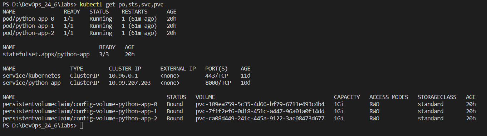
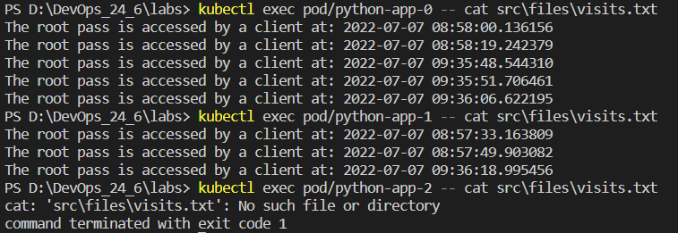

# Lab13

## output of kubectl get po,sts,svc,pvc command

## the content of visits file, in each pod

## Explaination the differences between the replicas

Because each replica pod gets a unique PersistentVolumeClaim associated with it. In other words, no shared volume as what we see in Deployment. So each replica of the pod have its own state and use its own Volume. When we made a request to the cluster, each time it chooses a pod to serve us.

## Why ordering guarantee are unnecessary in our application

Beacause each pod is independent from the remaining pods.
