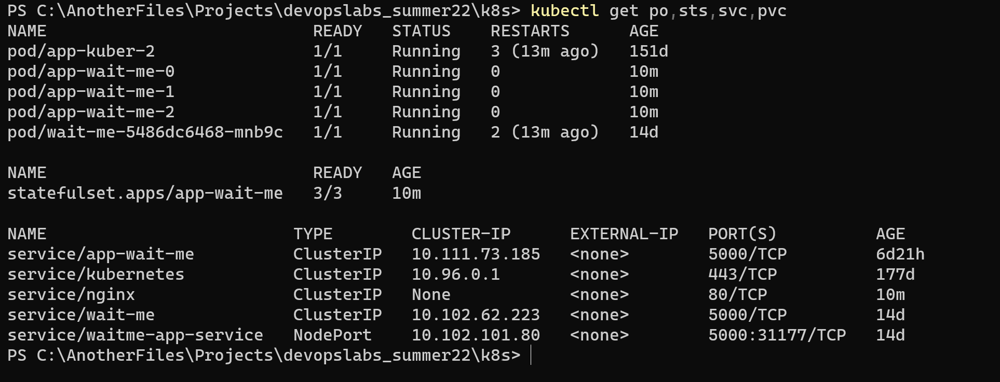

update helm

helm secrets upgrade app ./wait-me -n default -f ./secrets.yaml

## Screenshots

For our app ordering guarantee are unnecessary because we do not have database and its not obligatory to have master database replica, so second and later replicas will sync with first