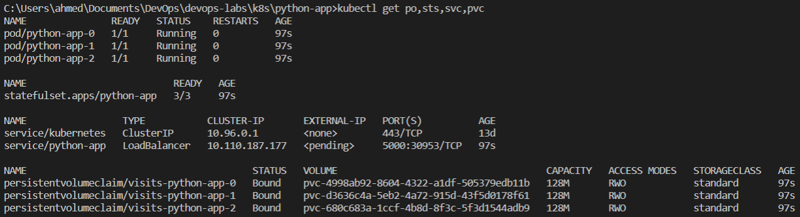
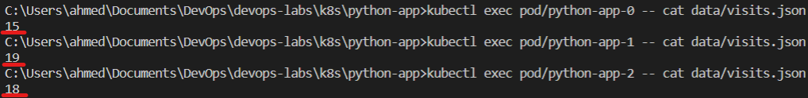

# Lab 13

## Output of `kubectl get` commands

## Number of visits per pod

### Reason for difference

The replicas (pods) have different values for the visit metric because each replica has a unique Persistent Volume assigned to it.

This is configured inside the `volumeClaimTemplates` paramters inside `statefulset.yaml`.

Thus, each pod gets its own separate storage with a separate `visits.json` file, and the value present there would depend on the number of times the load balancer decided to point the traffic to the pod.

## Unnecessary ordering

There is no necessity for ordering the execution or launching of the replicas as their logic is independent.

The time display logic does not depend on details from other replicas.
The visits metric is not required (as far as I understand) to be synced between the replicas.
There is no shared state.

### Parallel launching and termination

To avoid launching in order and to launch all replicas in parallel, we could set the `podManagementPolicy` paramter in the `spec` of the `statefulset.yaml` manifest to `Parallel`.

Reference from official documentaion [here](https://kubernetes.io/docs/concepts/workloads/controllers/statefulset/#parallel-pod-management).
