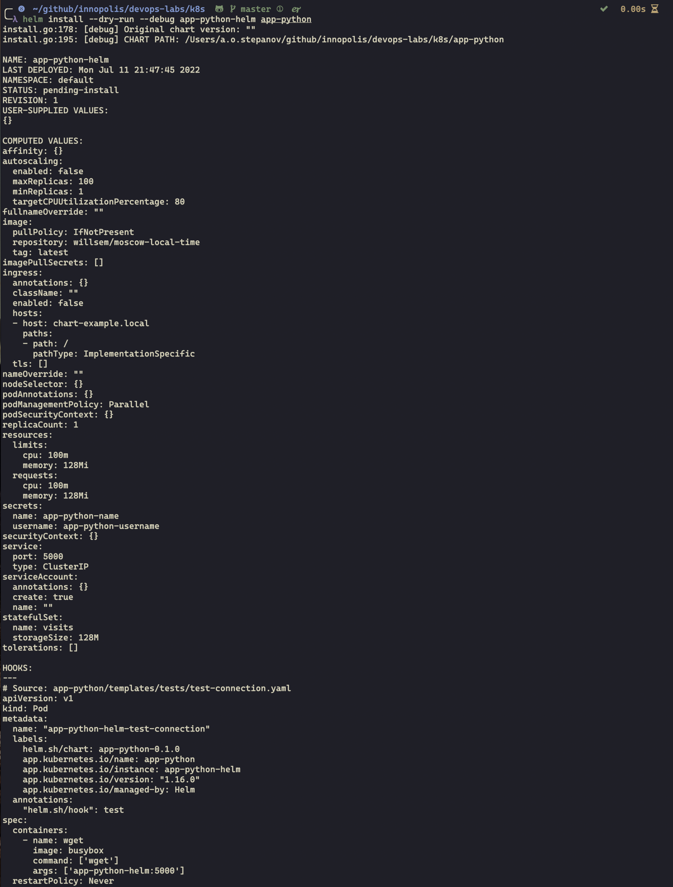
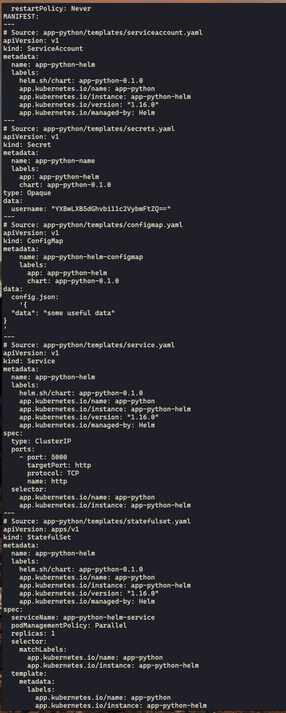
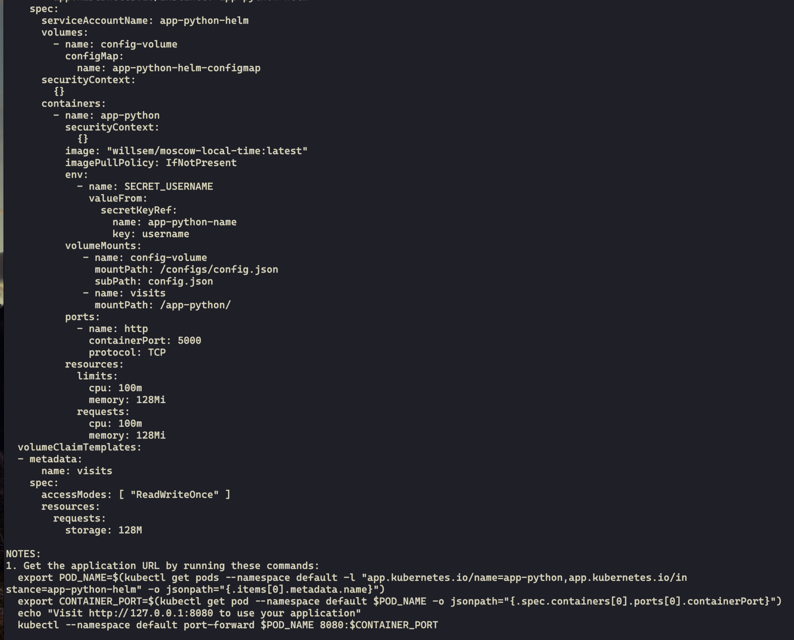
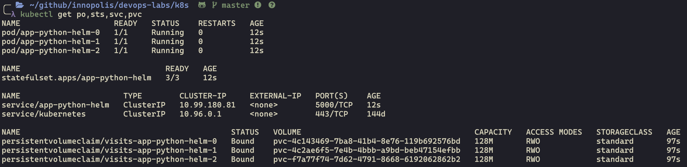
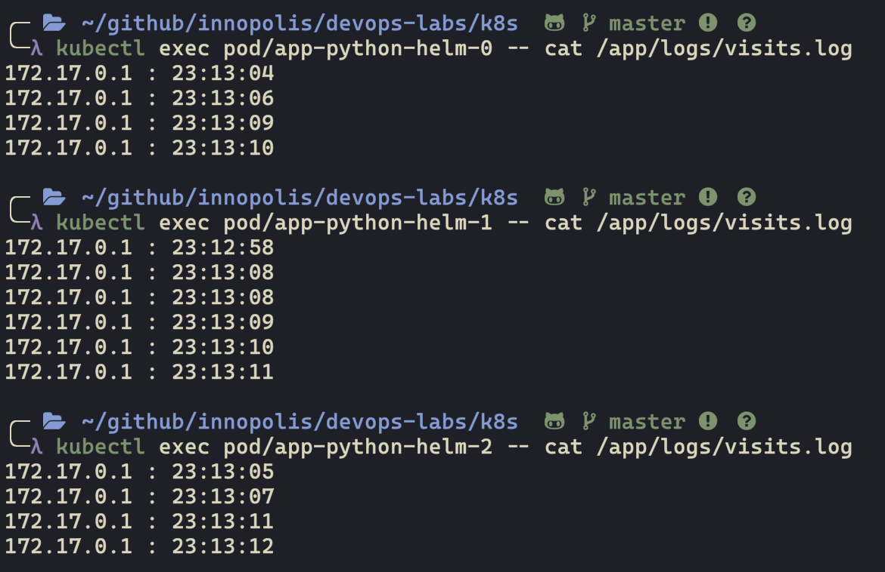

# Lab 13

## Helm install dry run

## kubactl get po, sts, svc, pvc

## Show visits of different pods

## Why outputs different?

Because each pod has its own file `visits.log`. So, when we try to make request to the cluster it chooses one pod from them, and after request pod which takes our request writes to its own file `visits.log`.

## Why ordering guarantee are unnecessary for our app?

Ordering guarantee are unnecessary because each pod independent from each other, because we don't have any logic between them.
