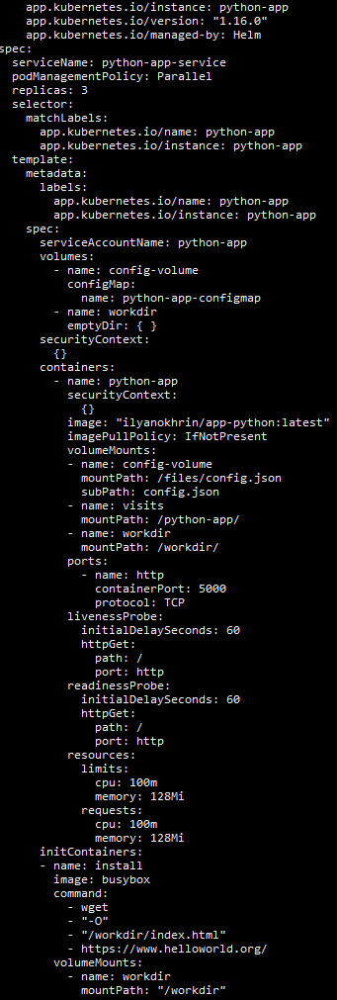
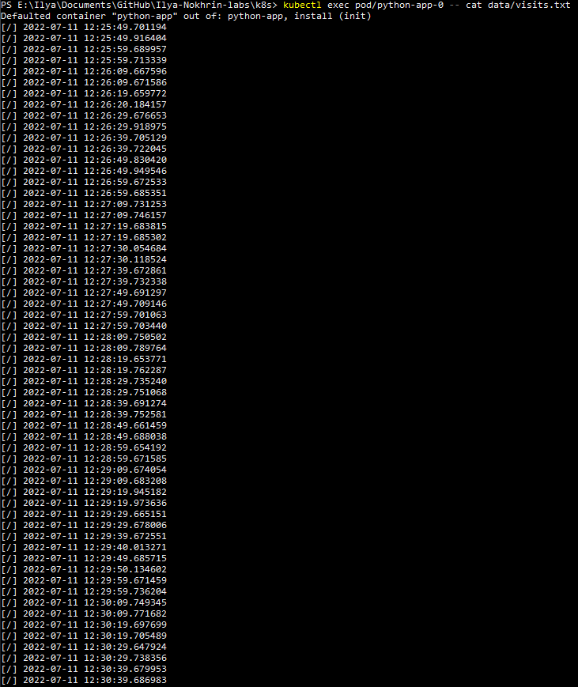

# Lab 13 
## Screenshots

1. Result of `helm install --dry-run --debug python-app python-app` command

2. Result of `kubectl get po,sts,svc,pvc` command

3. Results of `kubectl exec pod/python-app-n -- cat data/visits.txt` commands 

* Pod `pod/python-app-0`

* Pod `pod/python-app-1`

* Pod `pod/python-app-2`

## Questions

1. Why are `-- cat data/visits.txt` outputs different for replicas?

That is because each of the replicas has its own `visits.txt` file. Every time any page is opened, a certain replica is chosen to handle the request. That's why the results are unique - each individual request is only handled (and logged) by one replica

2. Why is ordering guarantee unnecessary?

In this particular case different replicas are responsible for the same function, do not depend on each other and do not communicate in any way. Technically, even if all except for one replicas were down, service would still fully function (as all request would simply be handled by the remaining replica)

3. How to implement parallel launch/termination of pods?

By specifying `podManagementPolicy: "Parallel"` inside of `spec:` block of `statefulset.yaml`