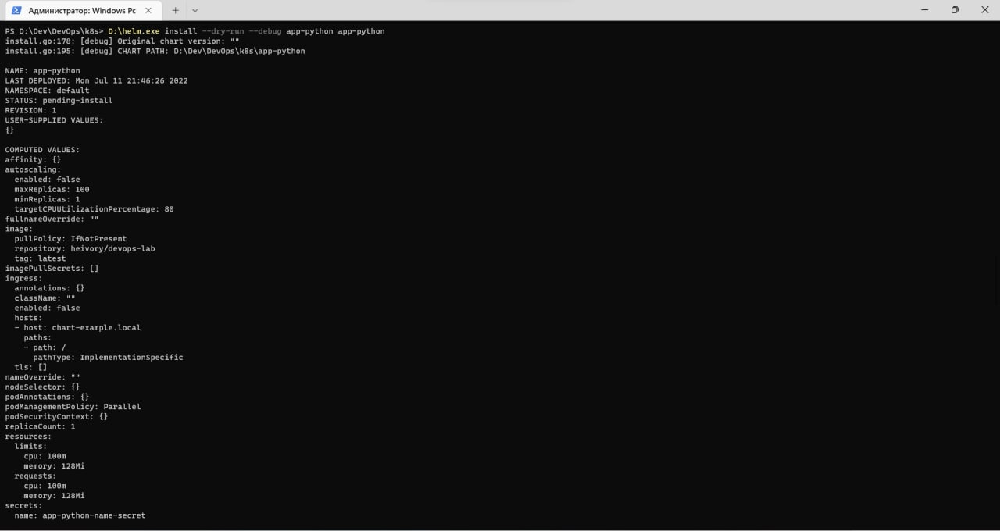

# Lab 13

## Screenshots

### Our outputs different due to existence of the file 'visits.txt' to each pods (separate files). When we try to make request to the cluster, it chooses one pod out of existed once. Then pod that takes request writes to its own file 'visits.txt'.

### We don't need ordering guarantee in order to keep each pod independent from each other as long as we don't have any logic between them.
