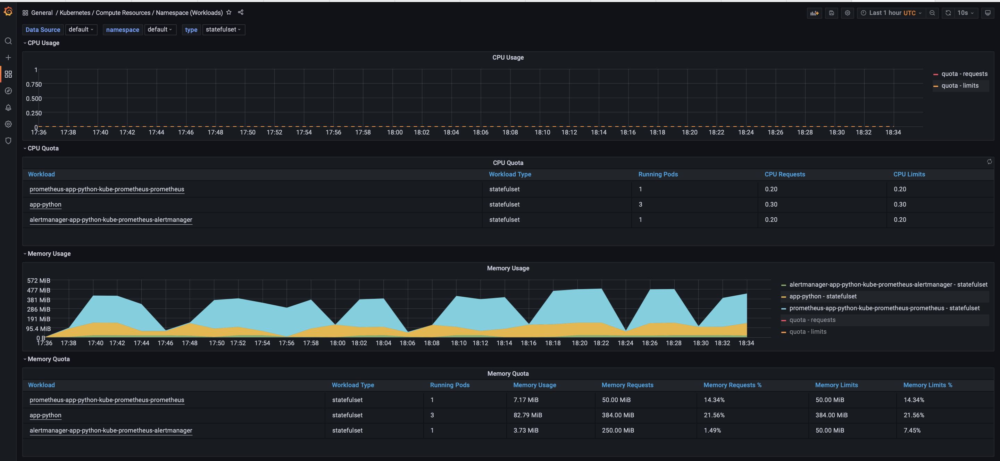
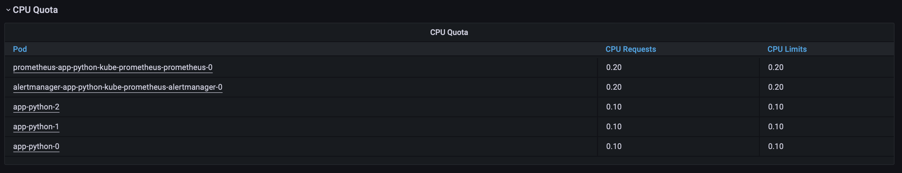
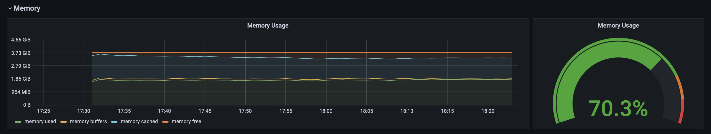
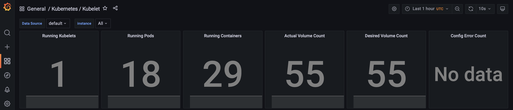
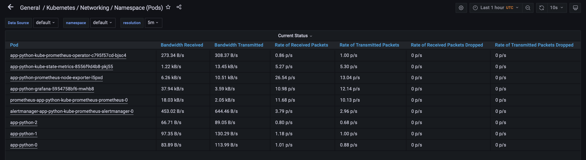
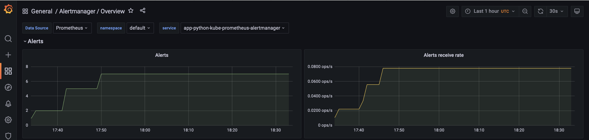

# Lab 14

## Components of the stack and their purpose

- **The Prometheus Operator**

    Purpose: Automate and simplify the configuration of a Prometheus by stack monitoring for Kubernetes clusters.


- **Highly available Prometheus**
    
  Purpose: Collect metrics and store them in database.


- **Highly available Alertmanager**

  Purpose: Deduplicating, grouping, and routing alerts from an clients application (like the Prometheus server) to the receiver (like email, OpsGenie, PagerDuty).


- **Prometheus node-exporter**
  
  Purpose: Export hardware and OS metrics.


- **Prometheus Adapter for Kubernetes Metrics APIs**
  
  Purpose: Replace the metrics server on clusters that already run Prometheus. Adapt data for autoscaling/v2 Horizontal Pod Autoscaler in Kubernetes 1.6+.

- **kube-state-metrics**
  
  Purpose: Generating metrics from Kubernetes API objects without modification.

- **Grafana**

  Purpose: Visualization of the metrics.  

## Add dependency 

### Generate Chart.lock

```
werf helm dependency update app-python
```

### Dependency update

```
helm dependency update app-python
```

### Install dependency

```
helm dependency build app-python
```

### Run

```
helm install app-python app-python
```

## kubectl get po,sts,svc,pvc,cm

The command show information from the cluster about:
- pods 
- stateful sets 
- services
- persistent volume claims
- configmaps

```
... % kubectl get po,sts,svc,pvc,cm     
NAME                                                         READY   STATUS    RESTARTS   AGE
pod/alertmanager-app-python-kube-prometheus-alertmanager-0   2/2     Running   0          86s
pod/app-python-0                                             1/1     Running   0          94s
pod/app-python-1                                             1/1     Running   0          94s
pod/app-python-2                                             1/1     Running   0          93s
pod/app-python-grafana-5954758bf6-lprx5                      3/3     Running   0          94s
pod/app-python-kube-prometheus-operator-c795f57cd-7cpzs      1/1     Running   0          94s
pod/app-python-kube-state-metrics-8556f9d4b8-k4q9g           1/1     Running   0          94s
pod/app-python-prometheus-node-exporter-dm8kt                1/1     Running   0          94s
pod/prometheus-app-python-kube-prometheus-prometheus-0       2/2     Running   0          84s

NAME                                                                    READY   AGE
statefulset.apps/alertmanager-app-python-kube-prometheus-alertmanager   1/1     86s
statefulset.apps/app-python                                             3/3     94s
statefulset.apps/prometheus-app-python-kube-prometheus-prometheus       1/1     84s

NAME                                              TYPE        CLUSTER-IP       EXTERNAL-IP   PORT(S)                      AGE
service/alertmanager-operated                     ClusterIP   None             <none>        9093/TCP,9094/TCP,9094/UDP   86s
service/app-python                                NodePort    10.106.12.131    <none>        5000:30247/TCP               94s
service/app-python-grafana                        ClusterIP   10.110.85.129    <none>        80/TCP                       94s
service/app-python-kube-prometheus-alertmanager   ClusterIP   10.104.247.211   <none>        9093/TCP                     94s
service/app-python-kube-prometheus-operator       ClusterIP   10.106.224.138   <none>        443/TCP                      94s
service/app-python-kube-prometheus-prometheus     ClusterIP   10.110.140.230   <none>        9090/TCP                     94s
service/app-python-kube-state-metrics             ClusterIP   10.100.67.115    <none>        8080/TCP                     94s
service/app-python-prometheus-node-exporter       ClusterIP   10.96.152.213    <none>        9100/TCP                     94s
service/kubernetes                                ClusterIP   10.96.0.1        <none>        443/TCP                      13d
service/prometheus-operated                       ClusterIP   None             <none>        9090/TCP                     84s

NAME                                        STATUS   VOLUME                                     CAPACITY   ACCESS MODES   STORAGECLASS   AGE
persistentvolumeclaim/visits-app-python-0   Bound    pvc-49d4f8ab-53af-4aa2-8090-eaccaa784d47   128M       RWO            standard       6d2h
persistentvolumeclaim/visits-app-python-1   Bound    pvc-5fc38214-8925-4abd-baf1-b0001409c7ff   128M       RWO            standard       6d2h
persistentvolumeclaim/visits-app-python-2   Bound    pvc-499da273-91d9-4c51-8a5a-fca78dbd0a66   128M       RWO            standard       6d2h

NAME                                                                     DATA   AGE
configmap/app-python-configmap                                           1      95s
configmap/app-python-grafana                                             2      95s
configmap/app-python-grafana-config-dashboards                           2      95s
configmap/app-python-grafana-test                                        1      95s
configmap/app-python-kube-prometheus-alertmanager-overview               1      95s
configmap/app-python-kube-prometheus-apiserver                           1      95s
configmap/app-python-kube-prometheus-cluster-total                       1      95s
configmap/app-python-kube-prometheus-controller-manager                  1      95s
configmap/app-python-kube-prometheus-etcd                                1      95s
configmap/app-python-kube-prometheus-grafana-datasource                  1      95s
configmap/app-python-kube-prometheus-grafana-overview                    1      95s
configmap/app-python-kube-prometheus-k8s-coredns                         1      95s
configmap/app-python-kube-prometheus-k8s-resources-cluster               1      95s
configmap/app-python-kube-prometheus-k8s-resources-namespace             1      95s
configmap/app-python-kube-prometheus-k8s-resources-node                  1      95s
configmap/app-python-kube-prometheus-k8s-resources-pod                   1      95s
configmap/app-python-kube-prometheus-k8s-resources-workload              1      95s
configmap/app-python-kube-prometheus-k8s-resources-workloads-namespace   1      95s
configmap/app-python-kube-prometheus-kubelet                             1      95s
configmap/app-python-kube-prometheus-namespace-by-pod                    1      95s
configmap/app-python-kube-prometheus-namespace-by-workload               1      95s
configmap/app-python-kube-prometheus-node-cluster-rsrc-use               1      95s
configmap/app-python-kube-prometheus-node-rsrc-use                       1      95s
configmap/app-python-kube-prometheus-nodes                               1      95s
configmap/app-python-kube-prometheus-nodes-darwin                        1      95s
configmap/app-python-kube-prometheus-persistentvolumesusage              1      95s
configmap/app-python-kube-prometheus-pod-total                           1      95s
configmap/app-python-kube-prometheus-prometheus                          1      95s
configmap/app-python-kube-prometheus-proxy                               1      95s
configmap/app-python-kube-prometheus-scheduler                           1      95s
configmap/app-python-kube-prometheus-workload-total                      1      95s
configmap/kube-root-ca.crt                                               1      13d
configmap/prometheus-app-python-kube-prometheus-prometheus-rulefiles-0   29     84s
```

## Get access to Grafana

The ```minikube service monitoring-grafana``` command doesn't work in my case. I used:

```
kubectl port-forward service/app-python-grafana 6127:80
```

and default login/password.

## Information about my cluster

### CPU and Memory my StatefulSet is consuming

CPU: ~0%

Memory: ~93 MiB




### Which Pod is using CPU more than others and which is less in the default namespace.



### How much memory is used on your node, in % and mb.



### How many pods and containers actually ran by the Kubelet service.



### Which Pod is using network more than others and which is less in the default namespace.



### How many alerts you have.



## Proofs that my init Container downloads a file

```
... % kubectl exec pod/app-python-0 -- cat /workdir/index.html
Defaulted container "app-python" out of: app-python, install (init)
<html><head></head><body><header>
<title>http://info.cern.ch</title>
</header>

<h1>http://info.cern.ch - home of the first website</h1>
<p>From here you can:</p>
<ul>
<li><a href="http://info.cern.ch/hypertext/WWW/TheProject.html">Browse the first website</a></li>
<li><a href="http://line-mode.cern.ch/www/hypertext/WWW/TheProject.html">Browse the first website using the line-mode browser simulator</a></li>
<li><a href="http://home.web.cern.ch/topics/birth-web">Learn about the birth of the web</a></li>
<li><a href="http://home.web.cern.ch/about">Learn about CERN, the physics laboratory where the web was born</a></li>
</ul>
</body></html>
```
