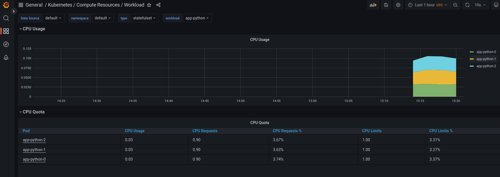
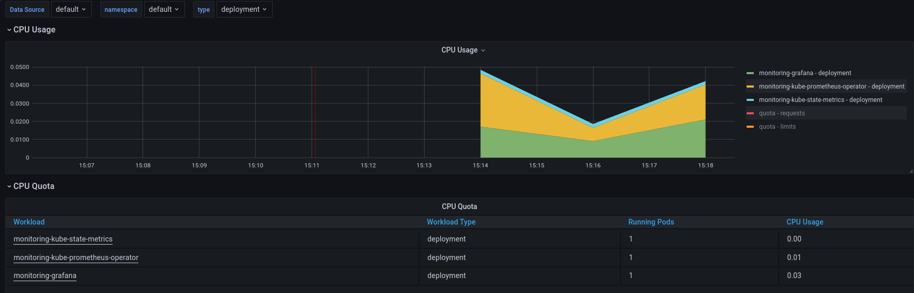
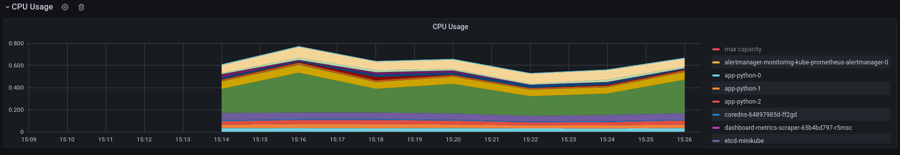
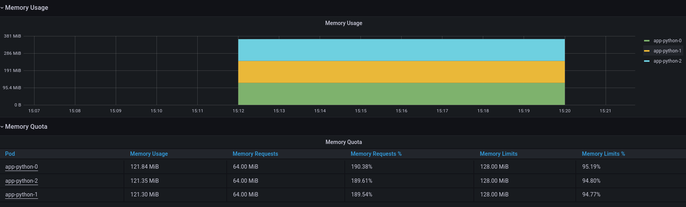
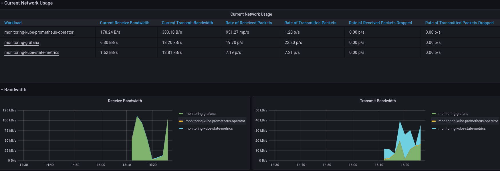
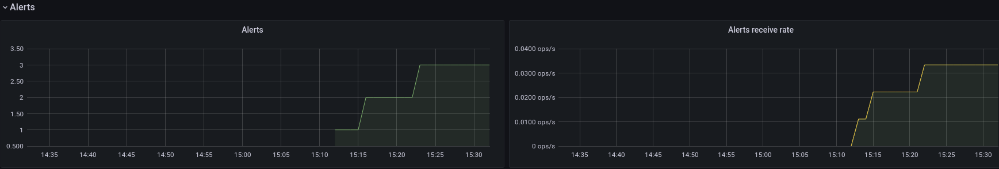
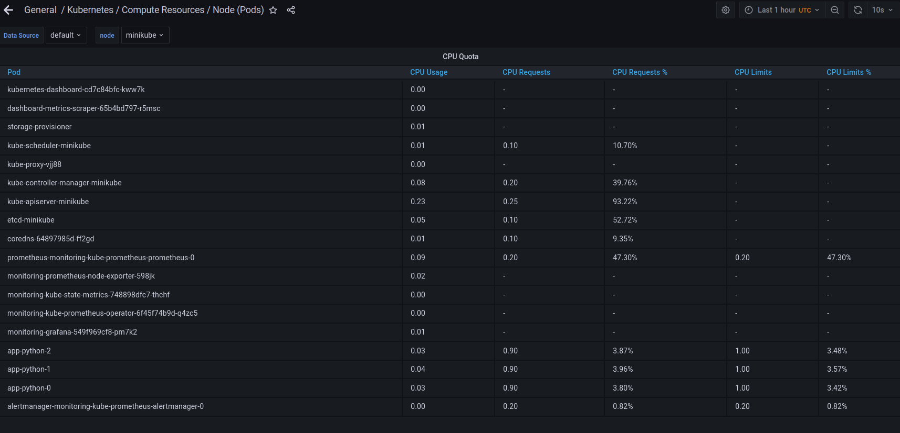
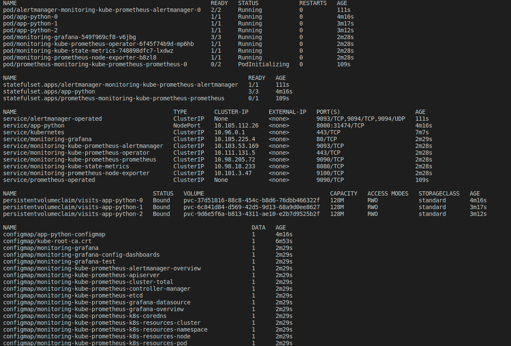

## Answers to 6 questions:

## Monitoring stack components

Grafana - graphical tool in order to visualize metrics

Prometheus Operator - it gives possibility to configure, deploy and manage prometheus components

kube-state-metrics - generates metrics about objects state which is connected to Kubernetes API

Highly available Prometheus - store metrics, put them in database in time-series format (or also in key-value pair if preferred).

Highly available Alert-manager - operates and manages the alerts notifications which are received from various applications. The manager later groups, analyzes metrics and sends them to specific receivers

Prometheus Adapter for Kubernetes Metrics APIs - The adapter can be used to substitute already running Prometheus metrics server in order to collect only necessary metrics.

Prometheus node-exporter - it is able to process a lot of low-level metrics (hardware and kernel )

## kubectl get po,sts, svc, pvc, cm Output and comment

It illustrates info about running pods, stateful sets, services, persistent volume claims and configmaps. With this command we are able to identify running/crashing pods, so the states services names, ports, ips...
