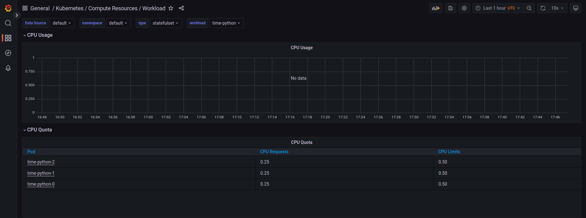
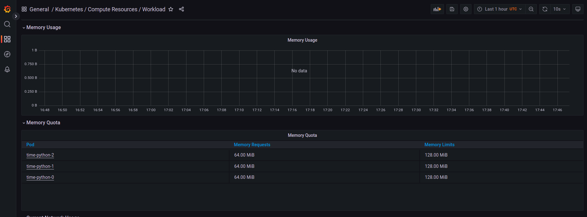
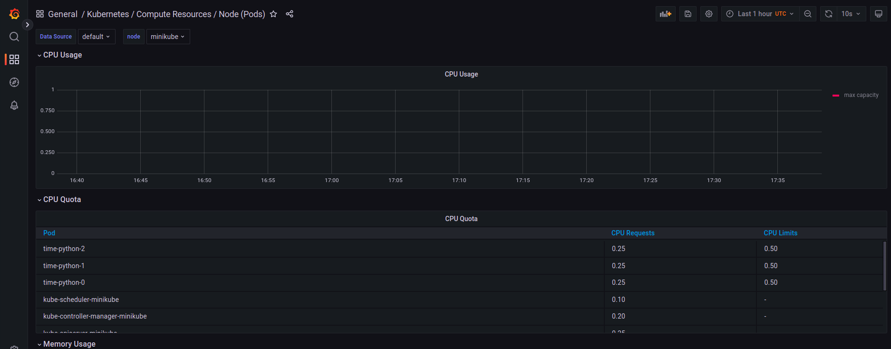
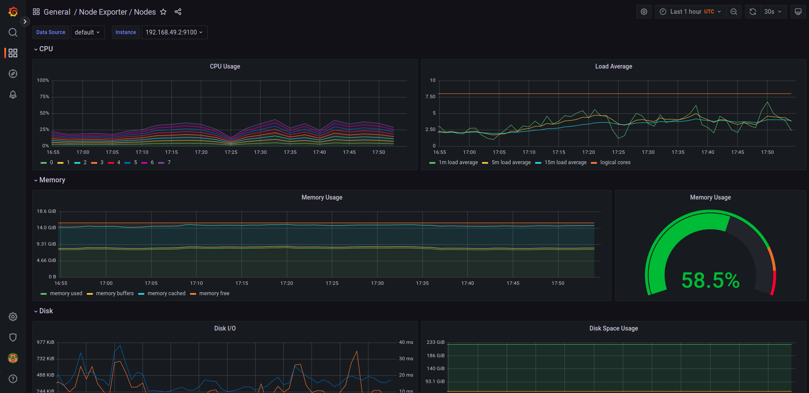
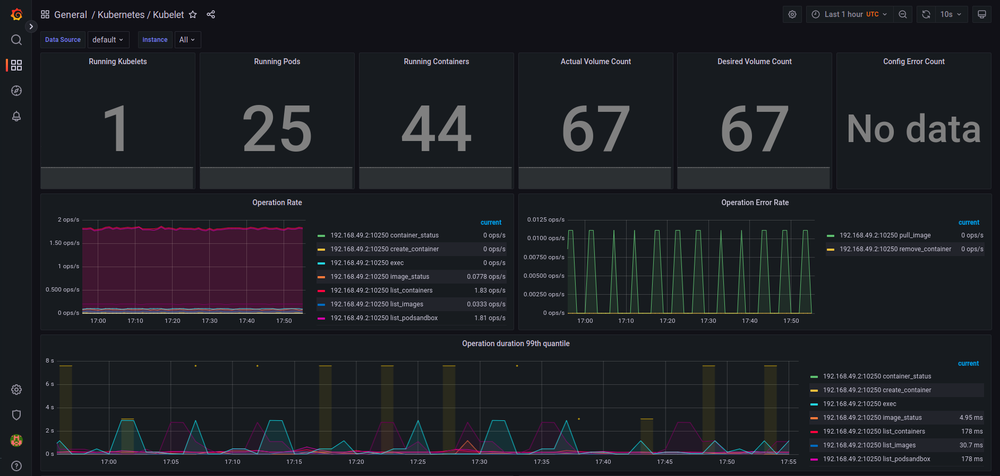
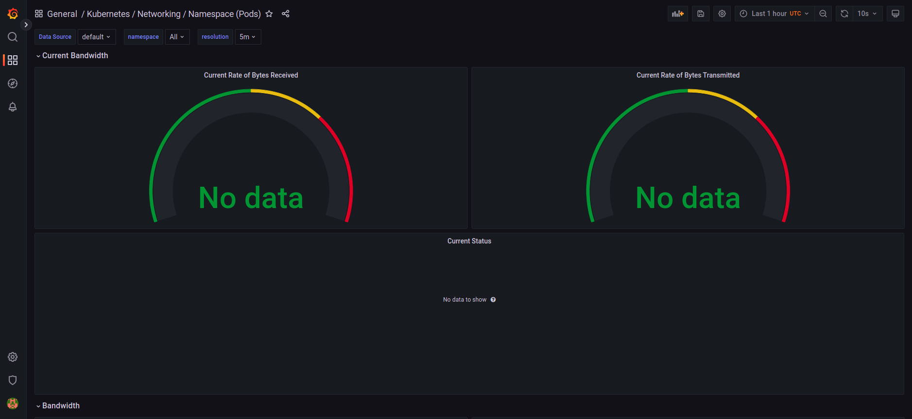
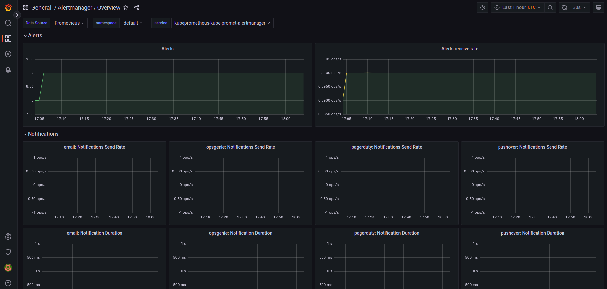

# Kube Prometheus Stack Components

    - Grafana:  Open-source visualization tool for monitoring and alerting.
    - Prometheus Operator: It is an extension for Kubernetes to ease monitoring in automated way. Features: K8s custom resources, simplified deployment, prometheus target configuration
    - Highly available Alertmanager: it handles alerts sent by client applications such as the Prometheus server.
    - Prometheus node-exporter: it is a exporter with configurable metrics.
    - Prometheus Adapter for Kubernetes Metrics APIs : it is a translator between the Prometheus server and the Kubernetes metrics APIs.
    - kube-state-metrics: it is a Prometheus exporter for the Kubernetes statefulset metrics.

# kubectl get po,sts,svc,pvc,cm

    igni@igni:~/Documents/devops-labs/k8s$ kubectl get po,sts,svc,pvc,cm
    NAME                                                         READY   STATUS             RESTARTS      AGE
    pod/alertmanager-kubeprometheus-kube-promet-alertmanager-0   2/2     Running            0             76s
    pod/app-app-python-5f6678bc-2tk8c                            1/1     Running            2 (75m ago)   10d
    pod/app-python-2-5499797494-n48m8                            1/1     Running            1 (75m ago)   4d20h
    pod/app-python-3-8599bb97dd-p2krz                            1/1     Running            1 (75m ago)   4d17h
    pod/app-python-as-6c5f788794-qln8x                           1/1     Running            0             24m
    pod/app-python-fdb5b9864-v8zn2                               1/1     Running            0             25m
    pod/app-python-o-5688964488-gv2cf                            1/1     Running            0             28m
    pod/asa                                                      0/1     ImagePullBackOff   0             40m
    pod/kubeprometheus-grafana-7c8c77bdd9-xvnm8                  3/3     Running            0             97s
    pod/kubeprometheus-kube-promet-operator-77b5f5cf7d-kt5rp     1/1     Running            0             97s
    pod/kubeprometheus-kube-state-metrics-679876d5f7-ghsfn       1/1     Running            0             97s
    pod/kubeprometheus-prometheus-node-exporter-nzx4l            1/1     Running            0             97s
    pod/prometheus-kubeprometheus-kube-promet-prometheus-0       0/2     PodInitializing    0             76s
    pod/time-python-0                                            1/1     Running            1 (75m ago)   4d20h
    pod/time-python-1                                            1/1     Running            1 (75m ago)   4d20h
    pod/time-python-2                                            1/1     Running            1 (75m ago)   4d20h

    NAME                                                                    READY   AGE
    statefulset.apps/alertmanager-kubeprometheus-kube-promet-alertmanager   1/1     76s
    statefulset.apps/prometheus-kubeprometheus-kube-promet-prometheus       0/1     76s
    statefulset.apps/time-python                                            3/3     4d20h

    NAME                                              TYPE        CLUSTER-IP       EXTERNAL-IP   PORT(S)                      AGE
    service/alertmanager-operated                     ClusterIP   None             <none>        9093/TCP,9094/TCP,9094/UDP   76s
    service/app-app-python                            ClusterIP   10.97.20.34      <none>        80/TCP                       10d
    service/app-python                                ClusterIP   10.103.125.20    <none>        80/TCP                       10d
    service/app-python-2                              ClusterIP   10.96.250.210    <none>        80/TCP                       4d20h
    service/app-python-3                              ClusterIP   10.103.218.166   <none>        80/TCP                       4d17h
    service/app-python-as                             ClusterIP   10.102.224.242   <none>        80/TCP                       24m
    service/app-python-o                              ClusterIP   10.105.199.113   <none>        80/TCP                       28m
    service/kubeprometheus-grafana                    ClusterIP   10.109.139.207   <none>        80/TCP                       97s
    service/kubeprometheus-kube-promet-alertmanager   ClusterIP   10.111.209.185   <none>        9093/TCP                     97s
    service/kubeprometheus-kube-promet-operator       ClusterIP   10.111.243.54    <none>        443/TCP                      97s
    service/kubeprometheus-kube-promet-prometheus     ClusterIP   10.103.22.161    <none>        9090/TCP                     97s
    service/kubeprometheus-kube-state-metrics         ClusterIP   10.98.70.121     <none>        8080/TCP                     97s
    service/kubeprometheus-prometheus-node-exporter   ClusterIP   10.96.7.162      <none>        9100/TCP                     97s
    service/kubernetes                                ClusterIP   10.96.0.1        <none>        443/TCP                      10d
    service/prometheus-operated                       ClusterIP   None             <none>        9090/TCP                     76s

    NAME                                      STATUS   VOLUME                                     CAPACITY   ACCESS MODES   STORAGECLASS   AGE
    persistentvolumeclaim/www-time-python-0   Bound    pvc-208a9d21-4669-400c-9e48-253f4ee83dda   1Gi        RWO            standard       4d20h
    persistentvolumeclaim/www-time-python-1   Bound    pvc-e8f0aa5e-f414-45c6-a83c-d0a275511679   1Gi        RWO            standard       4d20h
    persistentvolumeclaim/www-time-python-2   Bound    pvc-247d5c5d-7459-4a48-a5d9-b21832446c49   1Gi        RWO            standard       4d20h

    NAME                                                                     DATA   AGE
    configmap/app-app-python-configmap                                       1      10d
    configmap/app-python-2-configmap                                         1      4d20h
    configmap/app-python-3-configmap                                         1      4d17h
    configmap/app-python-as-configmap                                        1      24m
    configmap/app-python-configmap                                           1      10d
    configmap/app-python-o-configmap                                         1      28m
    configmap/kube-root-ca.crt                                               1      10d
    configmap/kubeprometheus-grafana                                         1      97s
    configmap/kubeprometheus-grafana-config-dashboards                       1      97s
    configmap/kubeprometheus-grafana-test                                    1      97s
    configmap/kubeprometheus-kube-promet-alertmanager-overview               1      97s
    configmap/kubeprometheus-kube-promet-apiserver                           1      97s
    configmap/kubeprometheus-kube-promet-cluster-total                       1      97s
    configmap/kubeprometheus-kube-promet-controller-manager                  1      97s
    configmap/kubeprometheus-kube-promet-etcd                                1      97s
    configmap/kubeprometheus-kube-promet-grafana-datasource                  1      97s
    configmap/kubeprometheus-kube-promet-grafana-overview                    1      97s
    configmap/kubeprometheus-kube-promet-k8s-coredns                         1      97s
    configmap/kubeprometheus-kube-promet-k8s-resources-cluster               1      97s
    configmap/kubeprometheus-kube-promet-k8s-resources-namespace             1      97s
    configmap/kubeprometheus-kube-promet-k8s-resources-node                  1      97s
    configmap/kubeprometheus-kube-promet-k8s-resources-pod                   1      97s
    configmap/kubeprometheus-kube-promet-k8s-resources-workload              1      97s
    configmap/kubeprometheus-kube-promet-k8s-resources-workloads-namespace   1      97s
    configmap/kubeprometheus-kube-promet-kubelet                             1      97s
    configmap/kubeprometheus-kube-promet-namespace-by-pod                    1      97s
    configmap/kubeprometheus-kube-promet-namespace-by-workload               1      97s
    configmap/kubeprometheus-kube-promet-node-cluster-rsrc-use               1      97s
    configmap/kubeprometheus-kube-promet-node-rsrc-use                       1      97s
    configmap/kubeprometheus-kube-promet-nodes                               1      97s
    configmap/kubeprometheus-kube-promet-nodes-darwin                        1      97s
    configmap/kubeprometheus-kube-promet-persistentvolumesusage              1      97s
    configmap/kubeprometheus-kube-promet-pod-total                           1      97s
    configmap/kubeprometheus-kube-promet-prometheus                          1      97s
    configmap/kubeprometheus-kube-promet-proxy                               1      97s
    configmap/kubeprometheus-kube-promet-scheduler                           1      97s
    configmap/kubeprometheus-kube-promet-workload-total                      1      97s
    configmap/prometheus-kubeprometheus-kube-promet-prometheus-rulefiles-0   29     76s

# CPU and memory usage of my Statefulset

# Highest CPU usage: My pods + kube-apiserver-minikube : they are using 0.25

# How much memory is used by my Node

# How much memory is used by my Node

# Which pod is using more network

# Alertmanager

