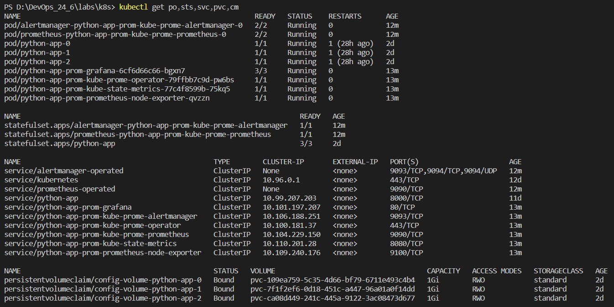
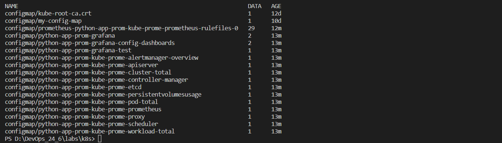
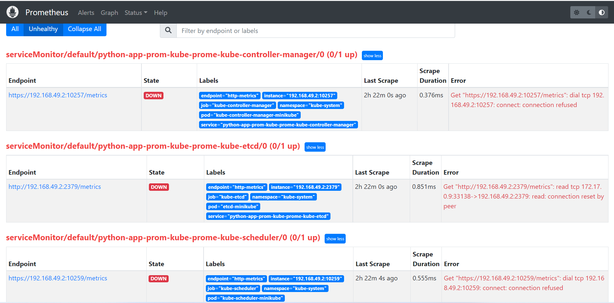
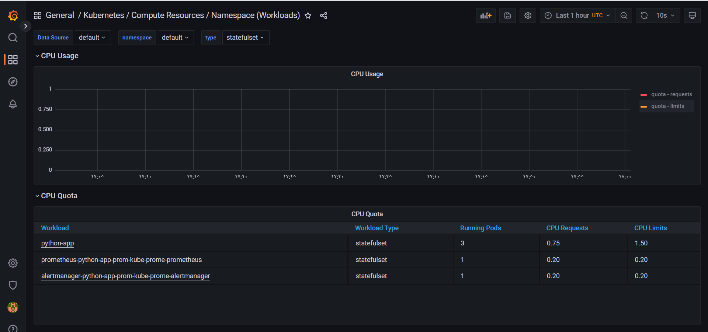
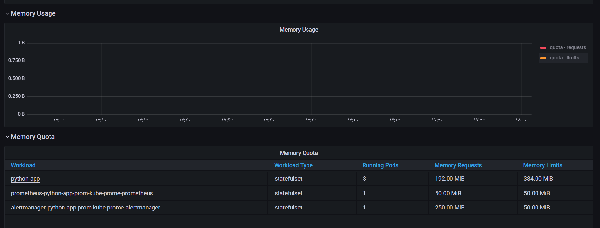
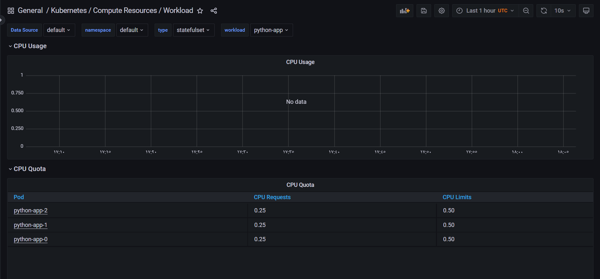
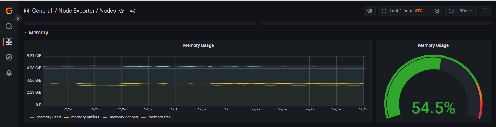
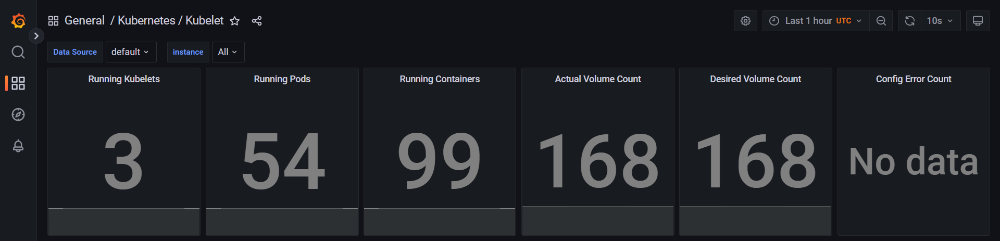
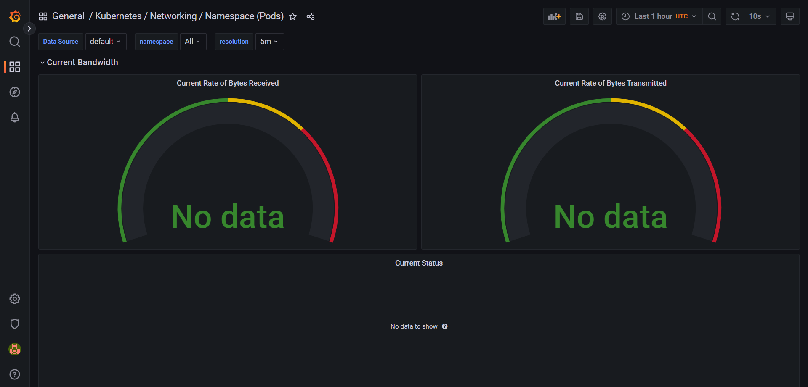
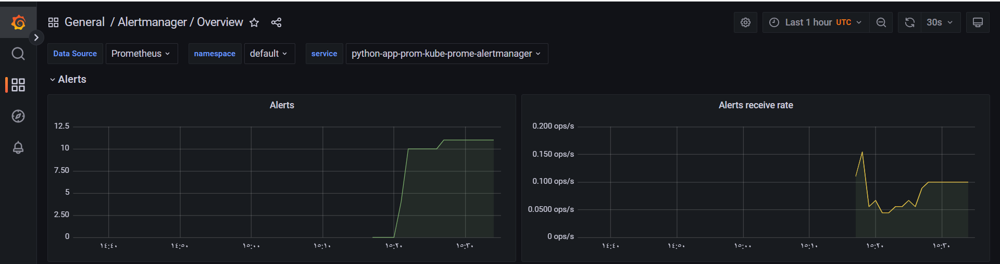

# Lab14

## Components of Kube Prometheus stack

1. Prometheus Operator: is used to manage prometheus instances ancd d deploy and configure  them for us.
2. Highly available Prometheus: collect metrics about the pods inside the cluster.
3. Highly available Alertmanager: It takes care of the alerts that comming from different client applications by deduplicating, grouping, and sending them to the correct receivers.
4. Prometheus node-exporter: supplying all the hardware and OS metrics of the entire nodes.
5. Prometheus Adapter for Kubernetes Metrics APIs: It provides APIs for Kubernetes resource, custom, and external Metrics. It is suitable for use with the autoscaling/v2 Horizontal Pod Autoscaler in Kubernetes.
6. kube-state-metrics: It generates metrics about the state of the Kubernetes components, deployments, nodes and pods. ex: CPU usage, network, disk, IO, and memory usage.
7. Grafana: It is used for visualization of the collected metrics.

## The output of the kubectl get po,sts,svc,pvc,cm

The kubectl get command is used for retrieving informations about resources of the same given resource types:

- po: pods
- sts: statefulsets
- svc: services
- pvc: persistentvolumeclaims
- cm: configmaps

Password for Grafana: admin/prom-operator

## Information about The cluster
I faced the following problem.

I tried to solve it as stated in this [link](https://groups.google.com/g/prometheus-users/c/_aI-HySJ-xM/m/kqrL1FYVCQAJ?pli=1) but didn't work.

1. how much CPU and Memory your StatefulSet is consuming:

2. which Pod is using CPU more than others and which is less in the default namespace.

3. how much memory is used on your node, in % and mb.

4. how many pods and containers actually ran by the Kubelet service.

5. which Pod is using network more than others and which is less in the default namespace.

6. how many alerts you have.

## init Container downloads a file

