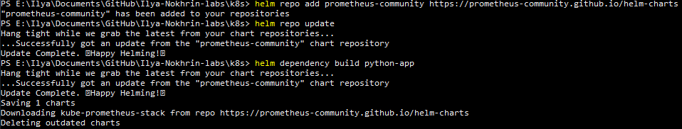
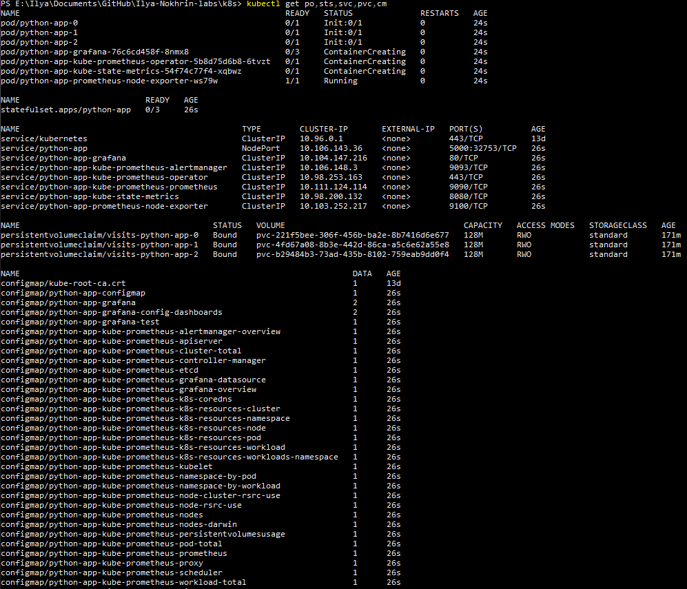
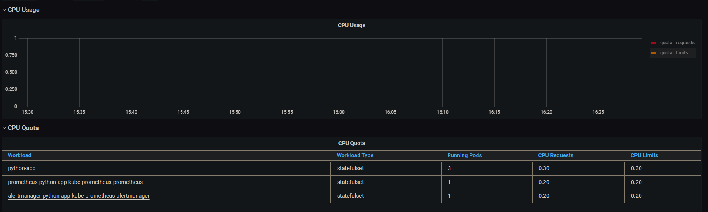
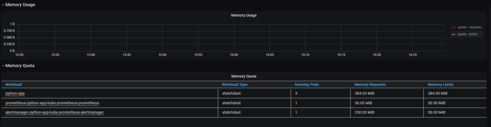
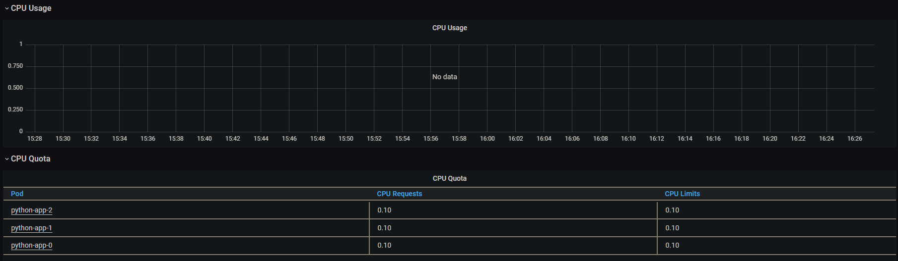
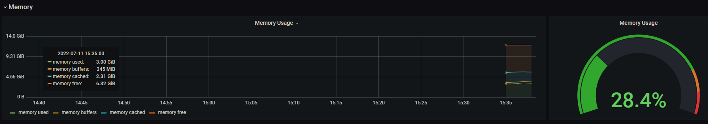
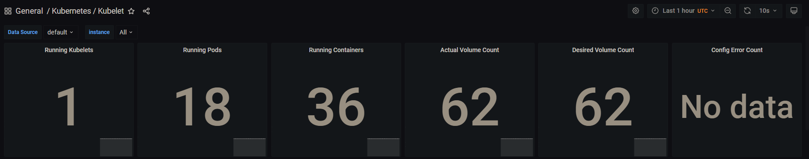
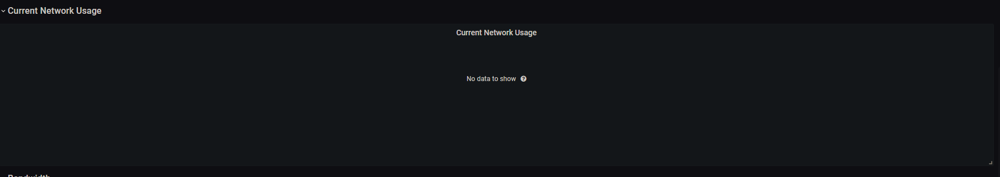
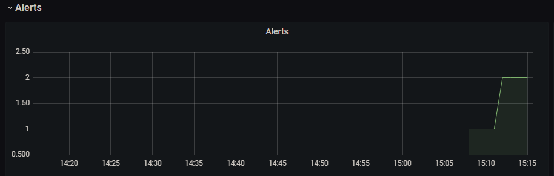
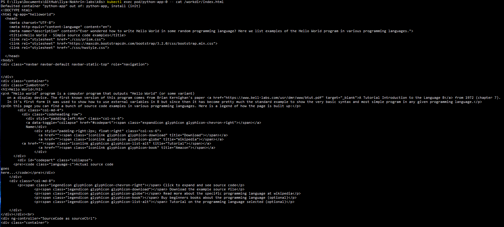

# Lab 14 report
## Components of the stack and their purpose

- **The Prometheus Operator**: automation and simplification of Prometheus configuration via stack monitoring for Kubernetes clusters.
- **Prometheus**: metrics collection and database storage
- **Alertmanager**: deduplication, grouping, and routing alerts from client applications (like the Prometheus server) to the endpoints
- **Prometheus node-exporter**: exporting of hardware and OS metrics
- **Prometheus Adapter for Kubernetes Metrics APIs**: replacing the metrics server on clusters that already run Prometheus. Also adapts data for autoscaling/v2 Horizontal Pod Autoscaler in Kubernetes 1.6+
- **kube-state-metrics**: generating metrics from Kubernetes API objects without modifying them
- **Grafana**: metrics visualisation

## Screenshots

1. Dependency installation

2. Result of `kubectl get po,sts,svc,pvc,cm` command

This command displays information about running kubectl components depending on the specified keys. Here:
* `po` provides information about **pods**
* `sts` provides information about **stateful sets**
* `svc` provides information about **services**
* `pvc` provides information about **persistent volume claims**
* `cm` provides information about **configmaps**

3. Grafana dashboard

Certain information wasn't displayed by Grafana despite setting the dashboard exactly as instructed

* CPU and Memory consumption of StatefulSets (not displayed)

* Pod CPU usage (not displayed)

* Memory usage on node

* Actual number of pods and containers

* Network usage by pods (no data)

* Alert count

4. Proof of `init Container` download

