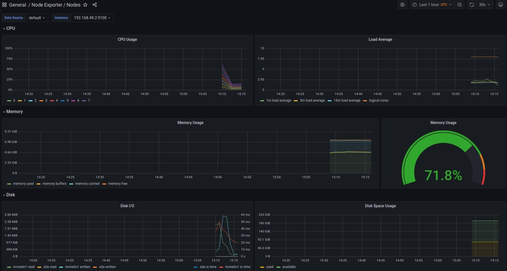
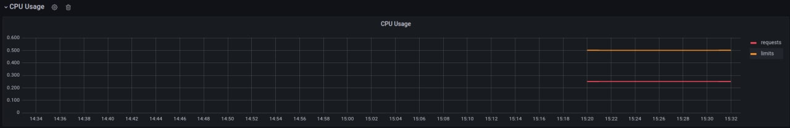
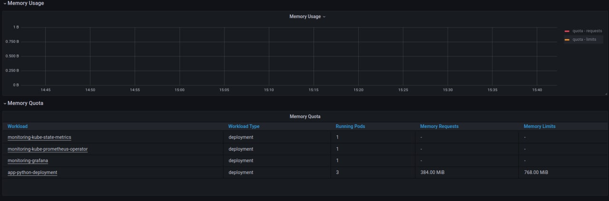
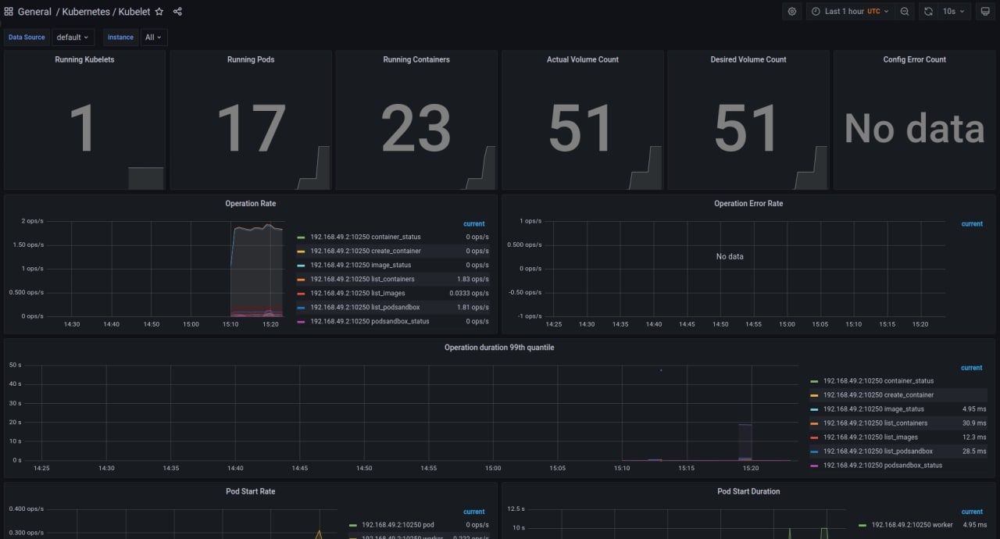
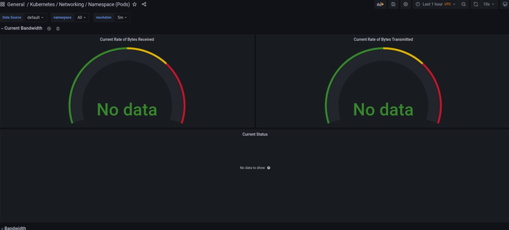
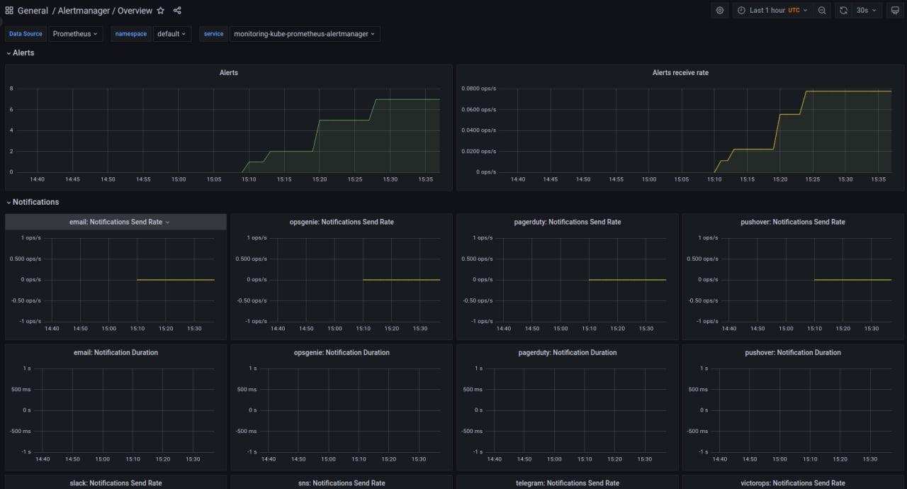

# The components of the stack and their purpose:
Components:
    - Grafana - for visualization
    - Prometheus node-exporter - for collecting various metrics
    - Prometheus operator - manages all the other components

# Result of running `kubectl get po,sts,svc,pvc,cm`:
We are getting information about:
    - po - pods
    - sts - statefulset
    - svc - services
    - pvc - persistant volumes
    - cm - configmap
```
NAME                                                          READY   STATUS              RESTARTS   AGE
pod/alertmanager-my-prometheus-stack-kube-p-alertmanager-0    2/2     Running             0          57s
pod/app-python-0                                              0/1     ContainerCreating   0          19s
pod/my-prometheus-stack-grafana-6c9bcbd9c7-qhrqc              3/3     Running             0          84s
pod/my-prometheus-stack-kube-p-operator-78997c486b-sljvb      1/1     Running             0          84s
pod/my-prometheus-stack-kube-state-metrics-787bb46747-b447s   1/1     Running             0          84s
pod/my-prometheus-stack-prometheus-node-exporter-j95vp        1/1     Running             0          84s
pod/prometheus-my-prometheus-stack-kube-p-prometheus-0        0/2     PodInitializing     0          57s

NAME                                                                    READY   AGE
statefulset.apps/alertmanager-my-prometheus-stack-kube-p-alertmanager   1/1     58s
statefulset.apps/app-python                                             0/1     19s
statefulset.apps/prometheus-my-prometheus-stack-kube-p-prometheus       0/1     57s

NAME                                                   TYPE        CLUSTER-IP       EXTERNAL-IP   PORT(S)                      AGE
service/alertmanager-operated                          ClusterIP   None             <none>        9093/TCP,9094/TCP,9094/UDP   58s
service/app-python                                     ClusterIP   10.105.41.195    <none>        80/TCP                       19s
service/kubernetes                                     ClusterIP   10.96.0.1        <none>        443/TCP                      8m34s
service/my-prometheus-stack-grafana                    ClusterIP   10.101.252.63    <none>        80/TCP                       84s
service/my-prometheus-stack-kube-p-alertmanager        ClusterIP   10.96.241.83     <none>        9093/TCP                     84s
service/my-prometheus-stack-kube-p-operator            ClusterIP   10.104.76.126    <none>        443/TCP                      84s
service/my-prometheus-stack-kube-p-prometheus          ClusterIP   10.107.227.127   <none>        9090/TCP                     84s
service/my-prometheus-stack-kube-state-metrics         ClusterIP   10.103.65.192    <none>        8080/TCP                     84s
service/my-prometheus-stack-prometheus-node-exporter   ClusterIP   10.100.30.94     <none>        9100/TCP                     84s
service/prometheus-operated                            ClusterIP   None             <none>        9090/TCP                     57s

NAME                                                                     DATA   AGE
configmap/app-python-configmap                                           1      19s
configmap/kube-root-ca.crt                                               1      8m19s
configmap/my-prometheus-stack-grafana                                    1      84s
configmap/my-prometheus-stack-grafana-config-dashboards                  1      84s
configmap/my-prometheus-stack-grafana-test                               1      84s
configmap/my-prometheus-stack-kube-p-alertmanager-overview               1      84s
configmap/my-prometheus-stack-kube-p-apiserver                           1      84s
configmap/my-prometheus-stack-kube-p-cluster-total                       1      84s
configmap/my-prometheus-stack-kube-p-controller-manager                  1      84s
configmap/my-prometheus-stack-kube-p-etcd                                1      84s
configmap/my-prometheus-stack-kube-p-grafana-datasource                  1      84s
configmap/my-prometheus-stack-kube-p-grafana-overview                    1      84s
configmap/my-prometheus-stack-kube-p-k8s-coredns                         1      84s
configmap/my-prometheus-stack-kube-p-k8s-resources-cluster               1      84s
configmap/my-prometheus-stack-kube-p-k8s-resources-namespace             1      84s
configmap/my-prometheus-stack-kube-p-k8s-resources-node                  1      84s
configmap/my-prometheus-stack-kube-p-k8s-resources-pod                   1      84s
configmap/my-prometheus-stack-kube-p-k8s-resources-workload              1      84s
configmap/my-prometheus-stack-kube-p-k8s-resources-workloads-namespace   1      84s
configmap/my-prometheus-stack-kube-p-kubelet                             1      84s
configmap/my-prometheus-stack-kube-p-namespace-by-pod                    1      84s
configmap/my-prometheus-stack-kube-p-namespace-by-workload               1      84s
configmap/my-prometheus-stack-kube-p-node-cluster-rsrc-use               1      84s
configmap/my-prometheus-stack-kube-p-node-rsrc-use                       1      84s
configmap/my-prometheus-stack-kube-p-nodes                               1      84s
configmap/my-prometheus-stack-kube-p-nodes-darwin                        1      84s
configmap/my-prometheus-stack-kube-p-persistentvolumesusage              1      84s
configmap/my-prometheus-stack-kube-p-pod-total                           1      84s
configmap/my-prometheus-stack-kube-p-prometheus                          1      84s
configmap/my-prometheus-stack-kube-p-proxy                               1      84s
configmap/my-prometheus-stack-kube-p-scheduler                           1      84s
configmap/my-prometheus-stack-kube-p-workload-total                      1      84s
configmap/prometheus-my-prometheus-stack-kube-p-prometheus-rulefiles-0   29     57s
```


# Screenshots





