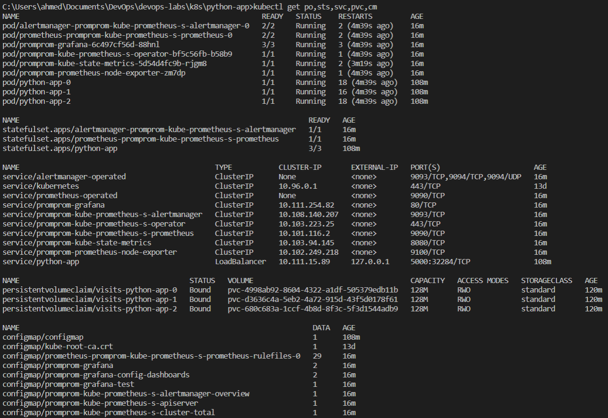
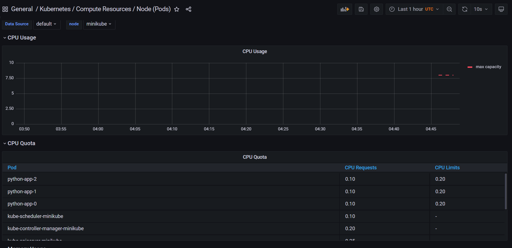
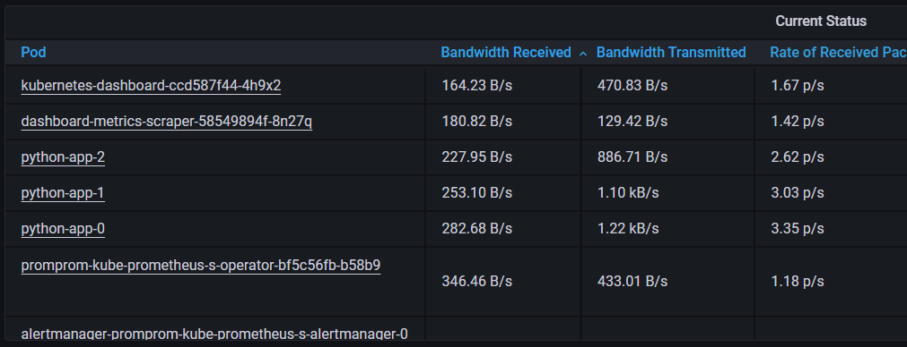

# Lab 14

## kube-prometheus-stack components

- Prometheus: a tool to monitor (and collect alerts) from your application.
- Prometheus Operator: facilitates the management and automation of Prometheus stack for K8s.
- Prometheus Node-exporter: monitor OS and hardware metrics.
- Kube State Metrics (KSM): collects and expose K8s cluster metrics (without modification).
- Prometheus Adapter: collects metrics from K8s Metrics API (adapted to Prometheus format).
- Grafana: A web dashboard application to present and visualize collected metrics.
- Prometheus Alertmanager: handles incoming alerts from applications. Benefits include alerts routing, grouping, dedeuplicating, and silencing of alerts.

## Result and meaning of `kubectl get`

### Command meaning

The `kubectl get po,sts,svc,pvc,cm` prints details on the specified objects running in K8s.

In this command, the following objects are printed:

- po: Pod
- sts: StatefulSet
- svc: Service
- pvc: Persistent Volume Claim
- cm: Config Map

By investigating the output after installing the `kube-prometheus-stack`,
one could find many services running beside the intended app.
For example, there is a large number of Config Maps (almost one per Prometheus Stack object).

## Dashboard Screenshots

### 1 and 2. CPU

For some reason, the CPU metrics are not being logged by Prometheus.

If you know why, please let me know and I will try to fix it.

I suspect it could be related to running the CPU monitoring service on Docker, without proper access.

Another issue could possibly be the misalignment of ports.

### 3. Memory used in node

### 4. Pods and containers by Kubelet

### 5. Network pods

### 6. Alerts

## Init Container

The file downloaded is a [simple HTML page](https://dataquestio.github.io/web-scraping-pages/simple.html).

