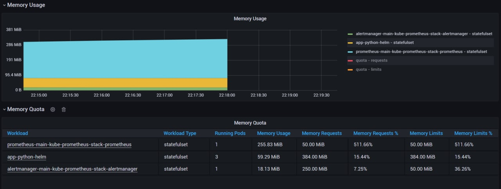

# Lab 14

## Components of the stack and their purpose:

### The Prometheus Operator
To automate the configuration of a Prometheus by stack monitoring for Kubernetes clusters.

### Highly available Prometheus
To collect metrics and store them in database.

### Grafana
To visualize the metrics.

### Highly available Alertmanager
To deduplicate, group, and route alerts from clients' application to the receiver.

### kube-state-metrics
To generate metrics from Kubernetes API objects without modification.

### Prometheus node-exporter
To export hardware and OS metrics.

### Prometheus Adapter for Kubernetes Metrics APIs
To replace the metrics server on clusters that already run Prometheus.

## Screenshots with answers to point 4
### 1

### 2

### 3

### 4

### 5

### 6

### Downloaded file (why we need container)
