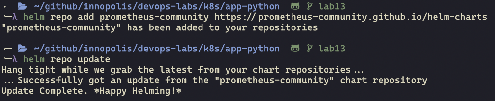

# Lab 14

## Components of the stack and their purpose

1. **Prometheus Operator** (automate and simplify the configuration of a Prometheus by stack monitoring for Kubernetes clusters)
2. **Highly available Prometheus** (collect metrics and store them in database)
3. **Highly available Alertmanager** (deduplicating, grouping, and routing alerts from an clients application to the receiver)
4. **Prometheus node-exporter** (export hardware and OS metrics)
5. **Prometheus Adapter for Kubernetes Metrics APIs** (replace the metrics server on clusters that already run Prometheus. Adapt data for autoscaling/v2 Horizontal Pod Autoscaler in Kubernetes 1.6+)
6. **kube-state-metrics** (generating metrics from Kubernetes API objects without modification)
7. **Grafana** (visualization of the metrics)

## Helm charts installation

## Get po,sts,svc,pvc,cm

## Starting Grafana

## Metrics

### CPU usage (Question 1)

### Memory usage (Question 1)

### CPU usage by pods (Question 2)

### Memory usage on node (Question 3)

### Pods and containers in Kubelet service (Question 4)

### Network usage by pods (Question 5)

### Alerts (Question 6)

## Downloaded file from pod

