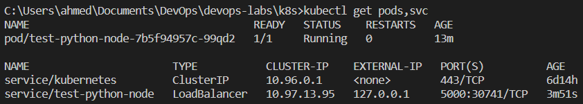
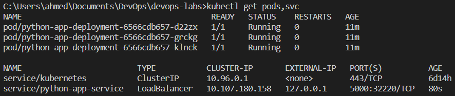
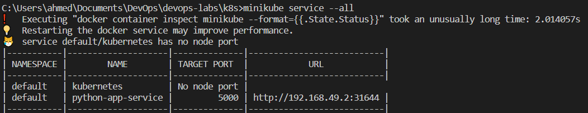
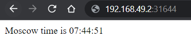
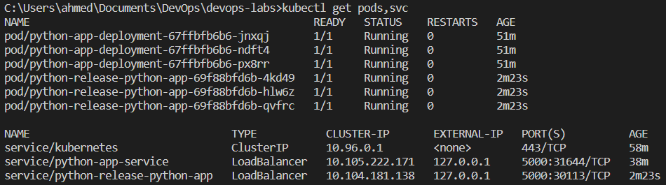
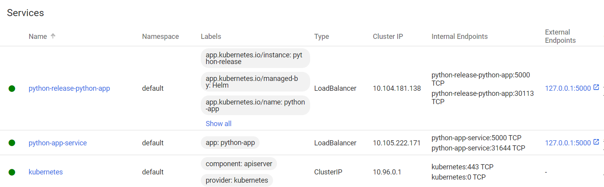

# Kubernetes

## kubectl get pods,svc

## minikube service --all

## helm

## Lab 9 Bonus

Created `flutter_deployment.yml` and `flutter_service.yml` for Flutter bonus project.

Definitions:

- Ingress: incoming data to the cluster
- Ingress controller: a required component for ingress to function. Not started automatically with a cluster
- StatefulSet: gives an unchangeable unique id to each pod. Useful for persistant data (using storage volumes)
- DaemonSet: makes sure that some or all nodes run a specific pod
- PersistentVolumes: k8s api for handling storage as a resource in a cluster
