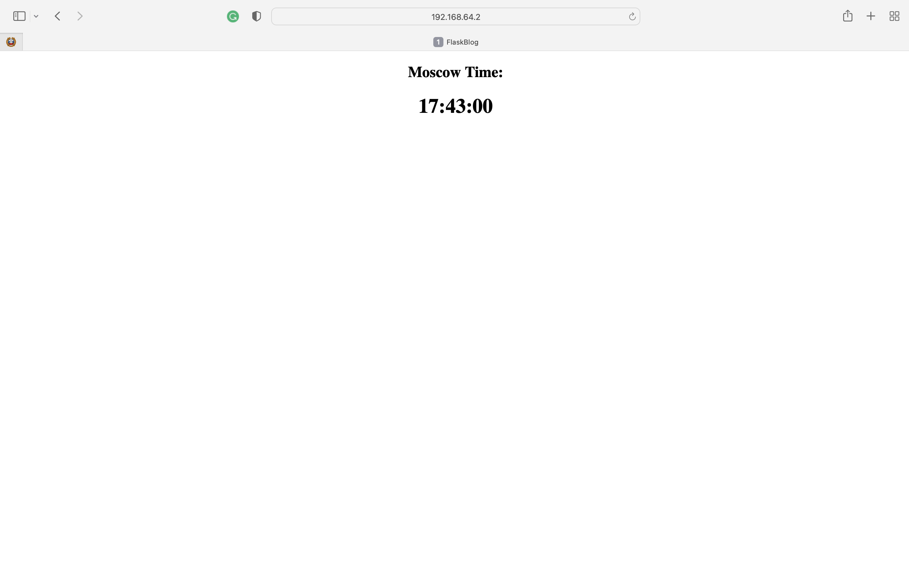
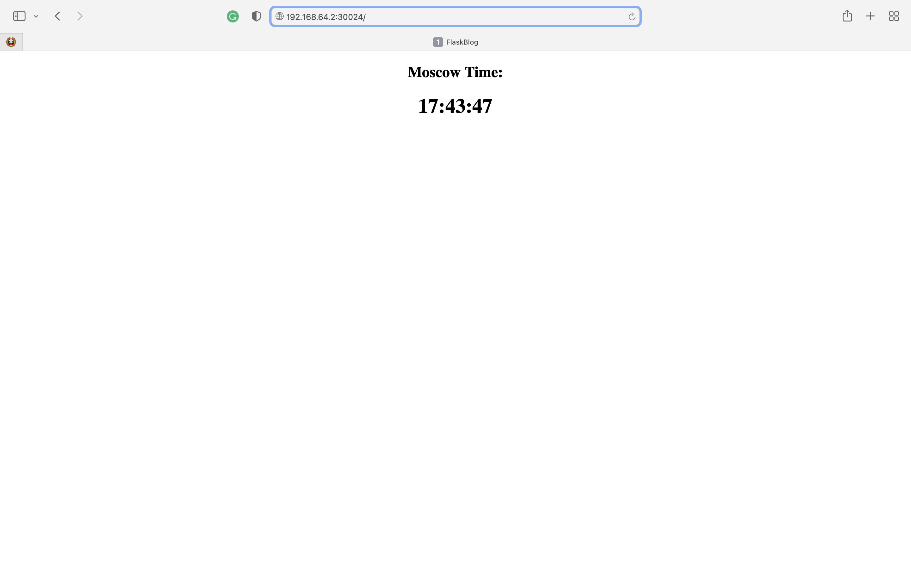

# k8s

## Manual

### Deployment

```
... % kubectl create deployment app-python --image=danilag/app-python
deployment.apps/app-python created

... % kubectl get deployments
NAME         READY   UP-TO-DATE   AVAILABLE   AGE
app-python   1/1     1            1           7s
```

### Service

```
... % kubectl expose deployment app-python --type=LoadBalancer --port=8080
service/app-python exposed

... % kubectl get services
NAME         TYPE           CLUSTER-IP     EXTERNAL-IP   PORT(S)          AGE
app-python   LoadBalancer   10.100.69.17   <pending>     8080:30509/TCP   7s
kubernetes   ClusterIP      10.96.0.1      <none>        443/TCP          12m
```

### pods, svc

```
% kubectl get pods,svc
NAME                              READY   STATUS    RESTARTS   AGE
pod/app-python-574df4cd67-v6dtl   1/1     Running   0          6m53s

NAME                 TYPE           CLUSTER-IP     EXTERNAL-IP   PORT(S)          AGE
service/app-python   LoadBalancer   10.100.69.17   <pending>     8080:30509/TCP   6m29s
service/kubernetes   ClusterIP      10.96.0.1      <none>        443/TCP          18m
```

### Clean up

```
... % kubectl delete service app-python
service "app-python" deleted

... % kubectl delete deployment app-python
deployment.apps "app-python" deleted
```

## From .yml

### Deployment

```
... % kubectl apply -f deployment.yml    
deployment.apps/app-python-deployment created
```

### Service

```
... % kubectl apply -f service.yml       
service/app-python-service created
```

### pods, svc

```
... % kubectl get pods,svc
NAME                                        READY   STATUS    RESTARTS   AGE
pod/app-python-deployment-dc699bfb9-2h9np   1/1     Running   0          11m
pod/app-python-deployment-dc699bfb9-8rvpd   1/1     Running   0          11m
pod/app-python-deployment-dc699bfb9-mfckj   1/1     Running   0          11m

NAME                         TYPE        CLUSTER-IP      EXTERNAL-IP   PORT(S)          AGE
service/app-python-service   NodePort    10.100.233.82   <none>        5000:30024/TCP   11m
service/kubernetes           ClusterIP   10.96.0.1       <none>        443/TCP          11m
```

### All services
```
... % minikube service --all
😿  service default/kubernetes has no node port
|-----------|--------------------|--------------|---------------------------|
| NAMESPACE |        NAME        | TARGET PORT  |            URL            |
|-----------|--------------------|--------------|---------------------------|
| default   | app-python-service |         5000 | http://192.168.64.2:30024 |
| default   | kubernetes         | No node port |
|-----------|--------------------|--------------|---------------------------|
```

### Screenshot




