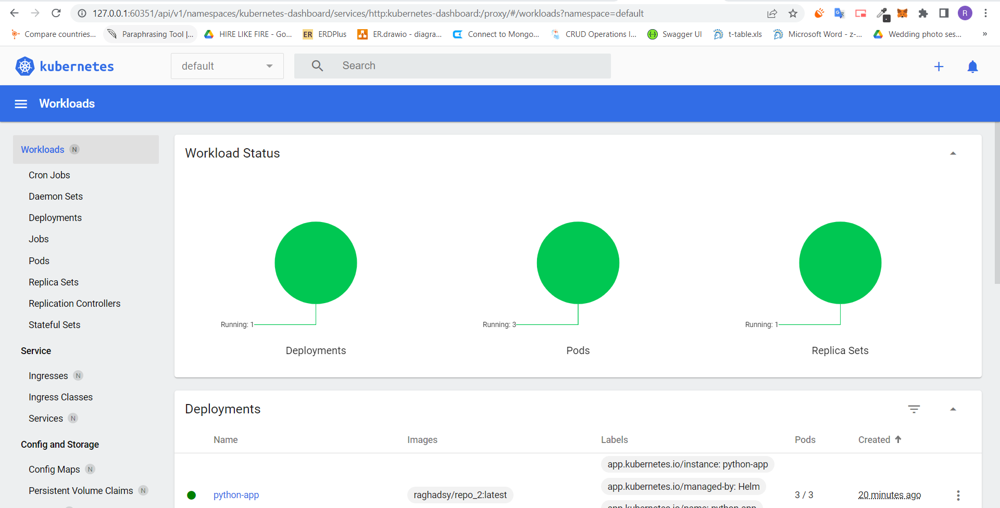
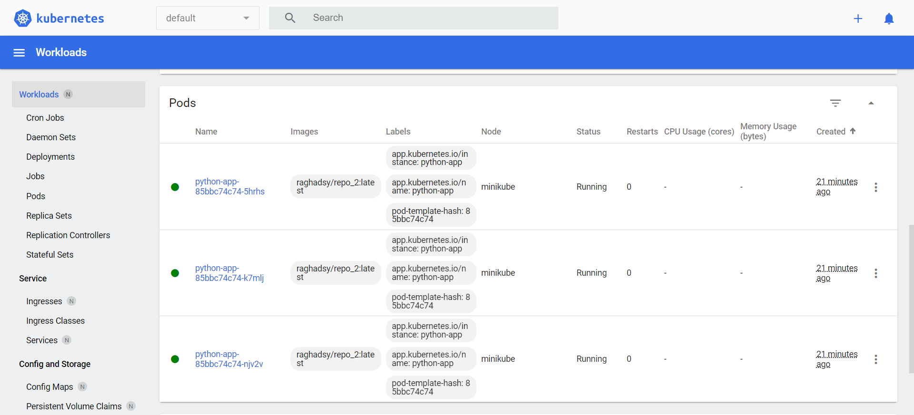
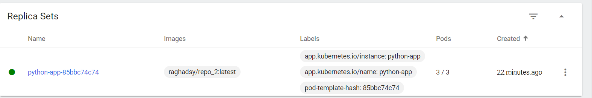
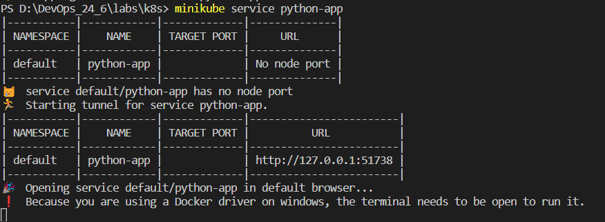
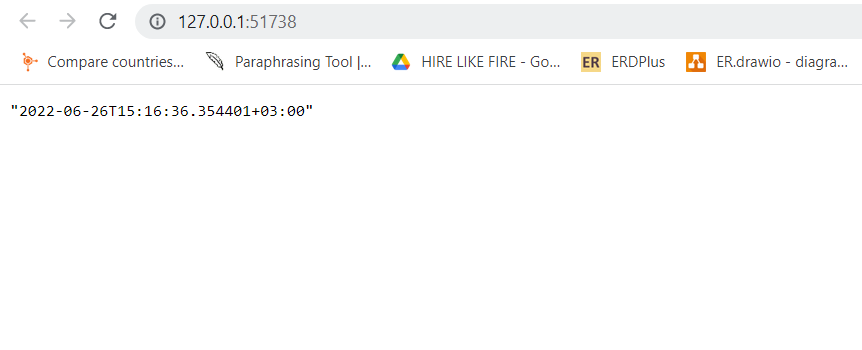
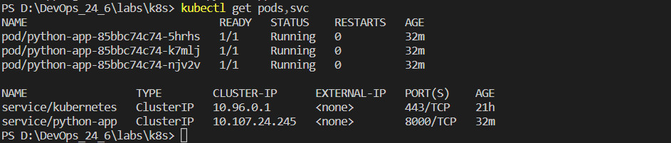

# Lab9

## The output of kubectl get pods,svc command

## The output of kubectl get pods,svc and minikube service --all commands (.yml)

## screenshots from browser

# Lab 10

## Workloads page in the minikube dashboard

## minikube service command output

## The output of kubectl get pods,svc command

