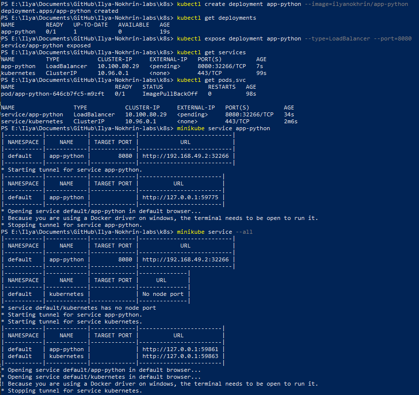
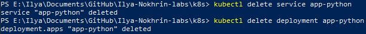
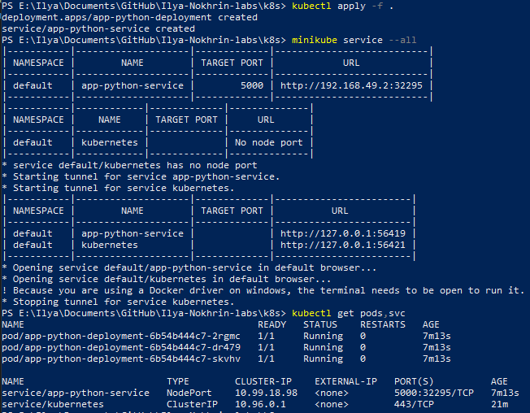
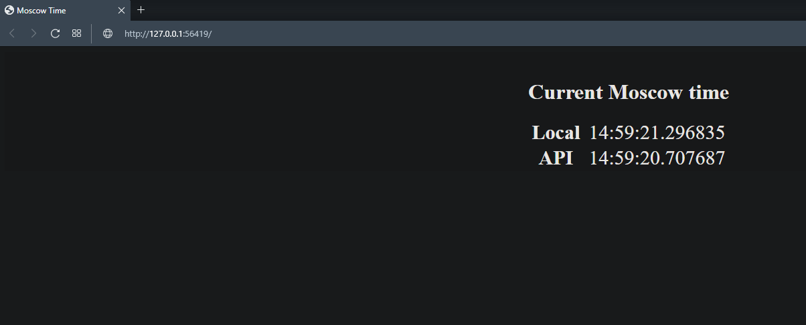
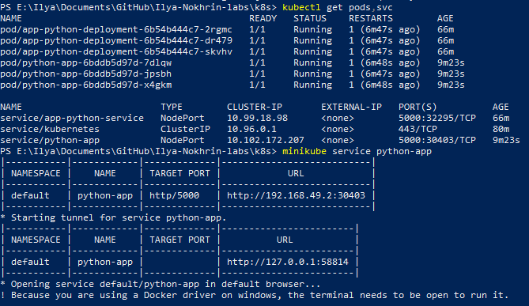
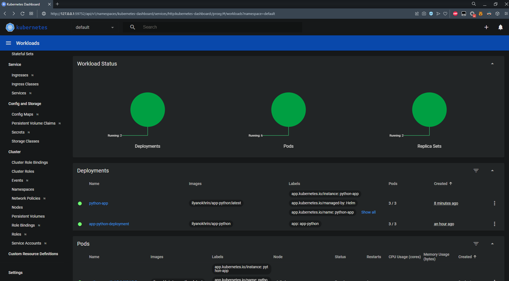

# Screenshots:

## Lab 9

1. Part 1 (manual configuration) + `kubectl get pods,svc` + `minikube service --all`

2. Part 1 cleanup

3. Part 2 (config deployment) + `kubectl get pods,svc` + `minikube service --all`

4. Browser screenshot (address matches the one in step 2)

## Lab 10

1. `kubectl get pods,svc` + `minikube service python-app`

2. Helm dashboard

