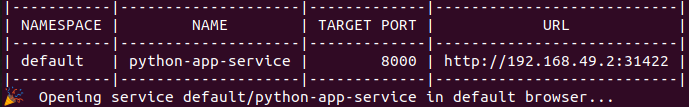
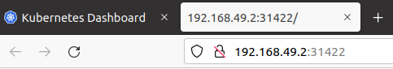

# LAB 10

### kubectl get pods,svc output(HELM)
```
NAME                                         READY   STATUS    RESTARTS      AGE
pod/app-python-helm-6575bbcc9b-pzklc         1/1     Running   0             38s
pod/python-app-deployment-54b99bfc96-184fg   1/1     Running   1 (17d ago)   17d
pod/python-app-deployment-54b99bfc96-ml9if   1/1     Running   1 (17d ago)   17d
pod/python-app-deployment-54b99bfc96-pcwz2   1/1     Running   1 (17d ago)   17d

NAME                         TYPE        CLUSTER-IP      EXTERNAL-IP   PORT(S)          AGE
service/app-python-helm      NodePort    10.98.72.63     <none>        8000:32139/TCP   38s
service/kubernetes           ClusterIp   10.96.0.1       <none>        443/TCP          19d
service/python-app-service   NodePort    10.99.239.250   <none>        8000:31422/TCP   18d
```


# LAB 9
# Before applying deployment:

### kubectl get pods output
```
NAME                          READY   STATUS    RESTARTS   AGE
python-app-5fcdcc8c6b-9bjck   1/1     Running   0          10m
```

### kubectl get svc output
```
NAME         TYPE           CLUSTER-IP     EXTERNAL-IP   PORT(S)          AGE
kubernetes   ClusterIP      10.96.0.1      <none>        443/TCP          35h
python-app   LoadBalancer   10.107.9.202   <pending>     8000:32074/TCP   6m31s
```

# After applying deployment:

### kubectl get pods output
```
NAME                                     READY   STATUS    RESTARTS   AGE
python-app-deployment-54b99bfc96-92zqw   1/1     Running   0          9m18s
python-app-deployment-54b99bfc96-fdv8q   1/1     Running   0          9m18s
python-app-deployment-54b99bfc96-znq5l   1/1     Running   0          9m18s
```

### kubectl get svc output
```
NAME                 TYPE        CLUSTER-IP      EXTERNAL-IP   PORT(S)          AGE
kubernetes           ClusterIP   10.96.0.1       <none>        443/TCP          37h
python-app-service   NodePort    10.99.239.250   <none>        8000:31422/TCP   85m
```

### minikube service output



### Web ip proof

