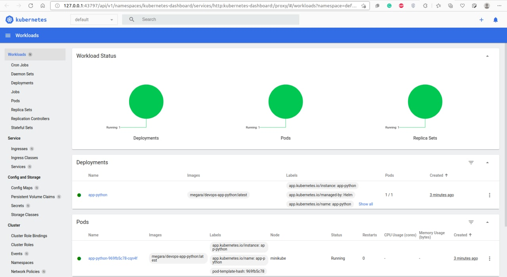
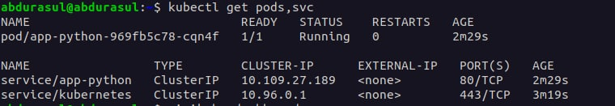

# Kubernates

## Output of `kubectl get pods,svc`:

## Output of `minikube service --all`:

## Website on browser with ip address:

# Helm
## Worloads at minikube dashboard:

## Output of `kubectl get pods,svc`:
