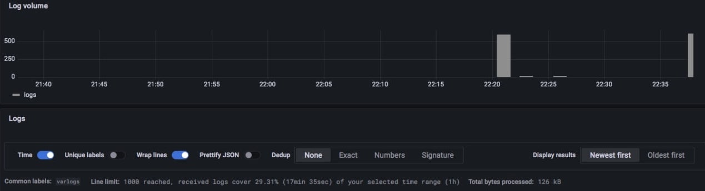
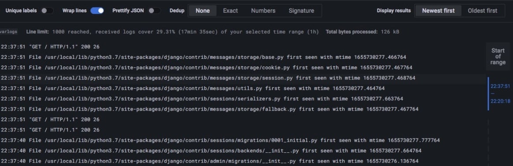

## Logging best practices

 - Use .env variables to configure images names and tags
 - Use regular expression to filter logs 
 - Configure Cache and log size
 - Time ordering of logs
 - Label values must always be bounded

## Log Volume

## Logs

