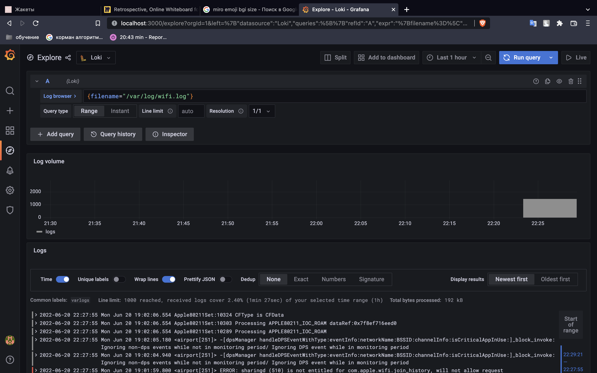

#Logging Best Practices

1. Automate your reviews
2. Make your logs accessible
3. Know what logs to monitor and what not to monitor
4. Leverage log data
5. Utilize tools for management

By following these best practices for logging and monitoring, the huge amount of information produced by your organization and devices can turn into a helpful tool for analysis and other business purposes. Carefully designing and perusing your log messages, and productive monitoring, are positive developments. To benefit from logging information most proficiently and successfully, you ought to depend on log management tools.