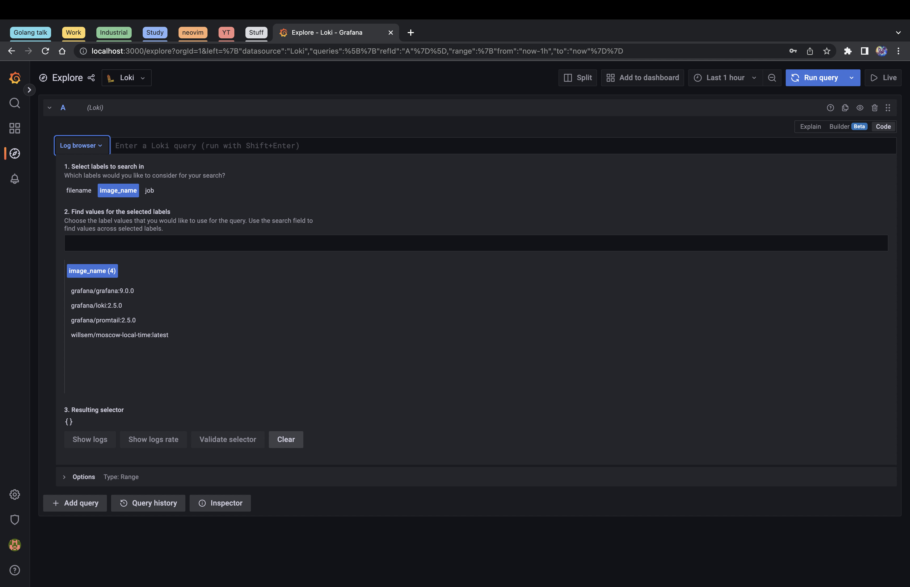
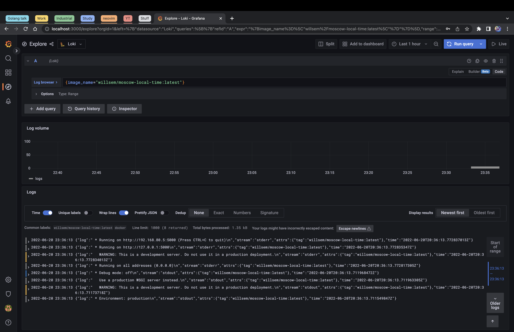

# Best practices for Loki

1. Use dynamic labels sparingly
2. Label values must always be bounded
3. Be aware of dynamic labels applied by clients
4. Configure caching
5. Time ordering of logs

# Lab 7

## List of runned containers

## Logs of python application

