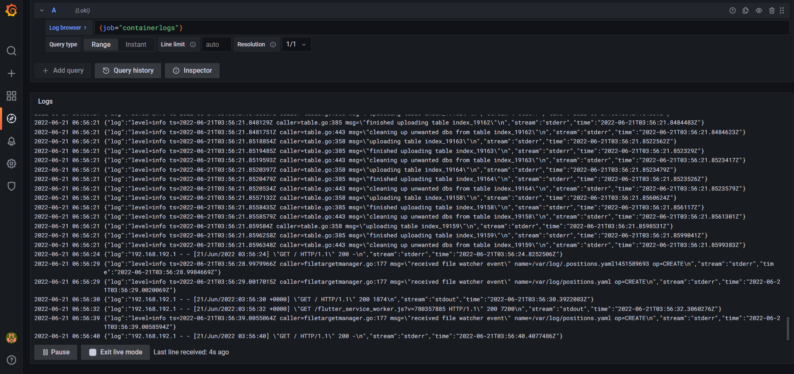

# Logging

## Best practice

Resource : [Official Grafana Documentation](https://grafana.com/docs/loki/next/best-practices/)

- Use static labels to make it easier to query your logs in a logical sense
- Do not add a label for something until you know you need it
- Never use a label which can have unbounded or infinite values (if dynamically setting labels)
- Configure caching for significant gains performance
- Time order logs by letting Promtail assign a timestamp to the log lines
- Use `chunk_target_size`. Larger chunks are more efficient for Loki to process
- Use `-print-config-stderr` to get output of the entire Loki configuration
- Use `-log-config-reverse-order` so that the order of the configuration reads correctly top to bottom when viewed in Grafana’s Explore

## Screensgots

Logs from Grafana explore dashboard

Includes logs from all containers (including Python and Flutter apps)

Docker compose containers displayed in Docker Desktop

## Bonus

The extra Flutter app is included in the Docker Compose file.

The logs from all containers are present in Grafana. This is achieved by an additional job in promtail.
