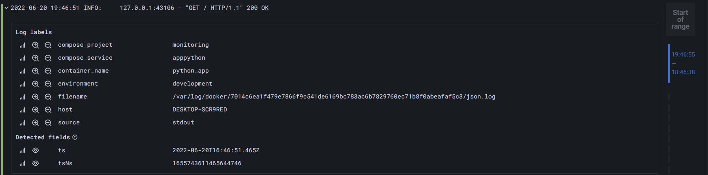

# Lab7

## Screenshots of success

## Description of the best practices

- Using static labels to make it easier to query your logs in a logical sense.
- Using dynamic labels sparingly to not reduce performance. The query {app="loki"} |= "level=error" is as fast as {app="loki",level="error"}. Also the query {app="loki",level!="debug"} have to load way more chunks than {app="loki"} != "level=debug". Try to avoid splitting a log file into streams, which result in chunks getting flushed because the stream is idle or hits the max age before being full.
- Avoid dynamic labels as much as possible and instead favor filter expressions. For example, don’t add a level dynamic label, just |= "level=debug" instead.
- Label values must always be bounded and not infinite values.
- Be aware of dynamic labels applied by clients. It is bad to use thing as a lable which had huge numbers of different values. In this case using filter expressions is the best practice.
- Configure caching for improving performance.
- Using chunk_target_size instructs Loki to try to fill all chunks to a target compressed size of 1.5MB. These larger chunks are more efficient for Loki to process.
If the application can log fast enough to fill these chunks quickly (much less than max_chunk_age), then it becomes more reasonable to use dynamic labels to break that up into separate streams.
- Use -print-config-stderr or -log-config-reverse-order. -print-config-stderr works well when invoking Loki from the command line, as you can get a quick output of the entire Loki configuration while -log-config-reverse-order is the flag we run Loki with in all our environments. The configuration entries are reversed, so that the order of the configuration reads correctly top to bottom when viewed in Grafana’s Explore.

Reference: [Grafana Loki label best practices
](https://grafana.com/docs/loki/latest/best-practices/)
