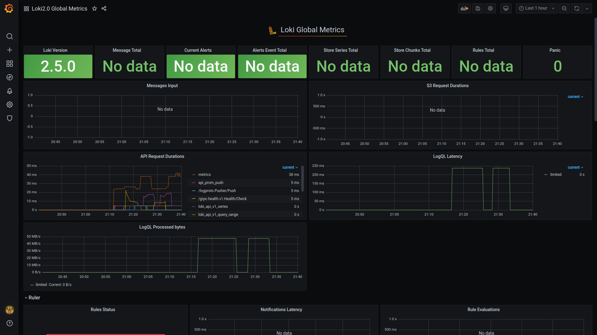

# Logging
Logging is integrated to the app_python using grafana and loki

# Best practices
 - Use dynamic labels sparingly
 - Label values must be bounded
 - Configure caching to improve performance
 - Use chunk_target_size to improve performance

# Screenshots
Logs from the application

Grafana Loki dashboard:

