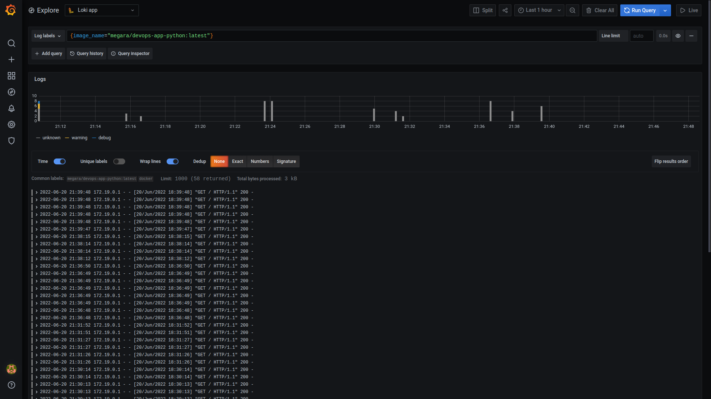
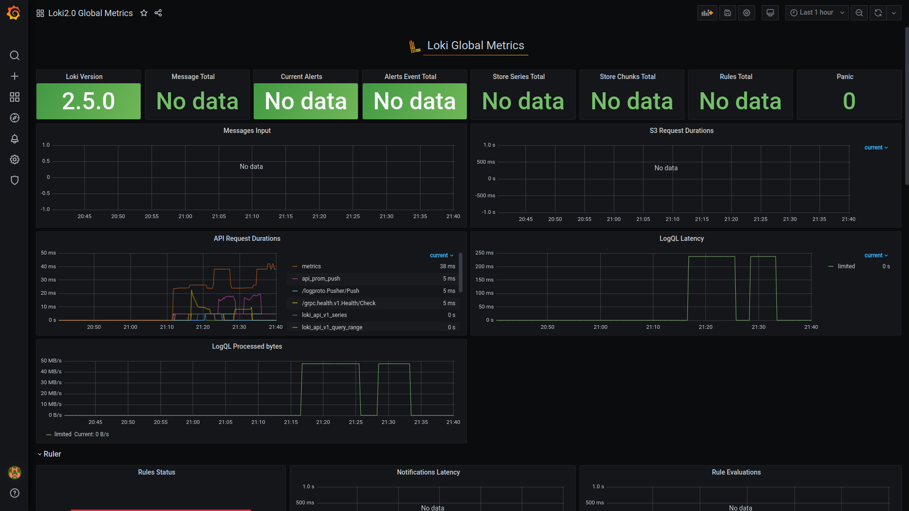
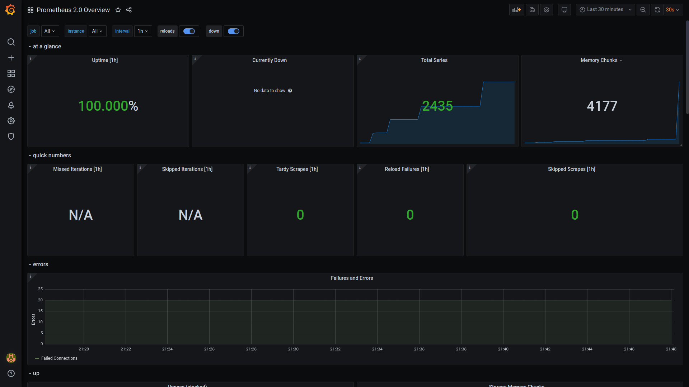
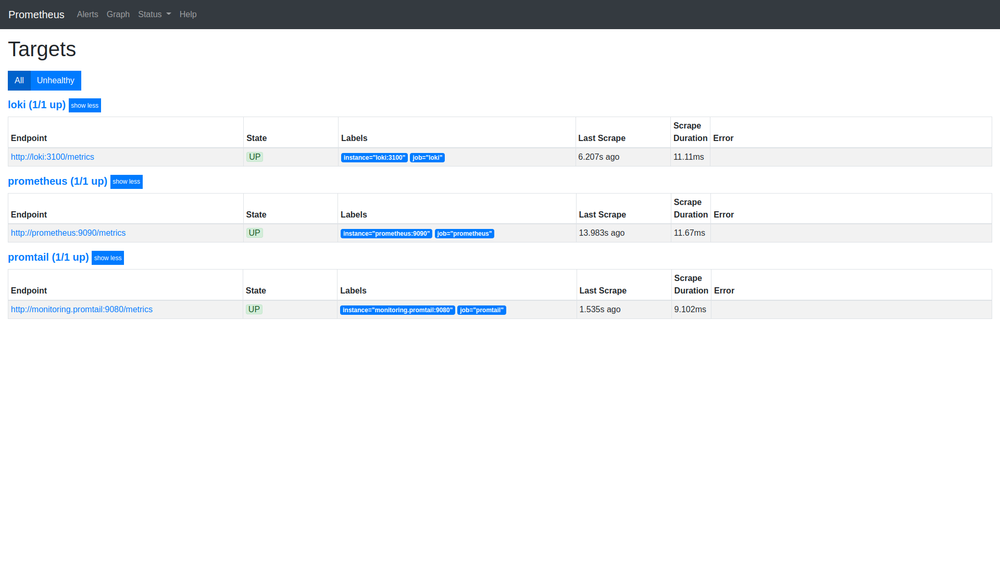

# Overview
Prometheus is used to collect metrics from grafana and loki.

# Loki screenshots
## Logs from app_python:

## Grafana dashboard for Loki

## Grafana dashboard for Prometheus

## Prometheus targets
