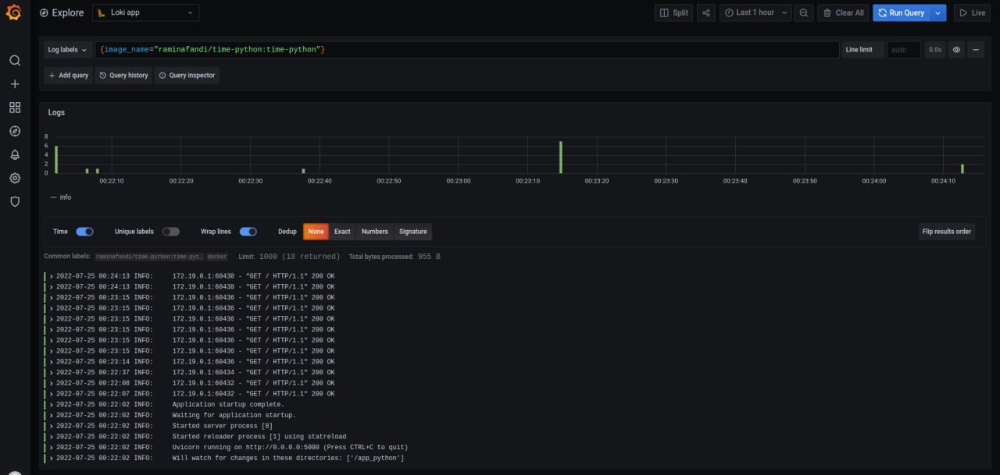
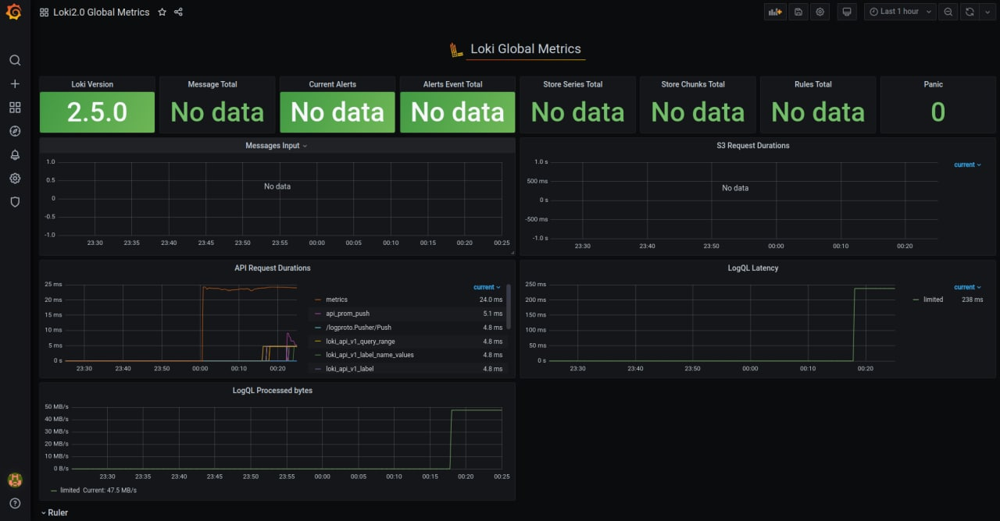
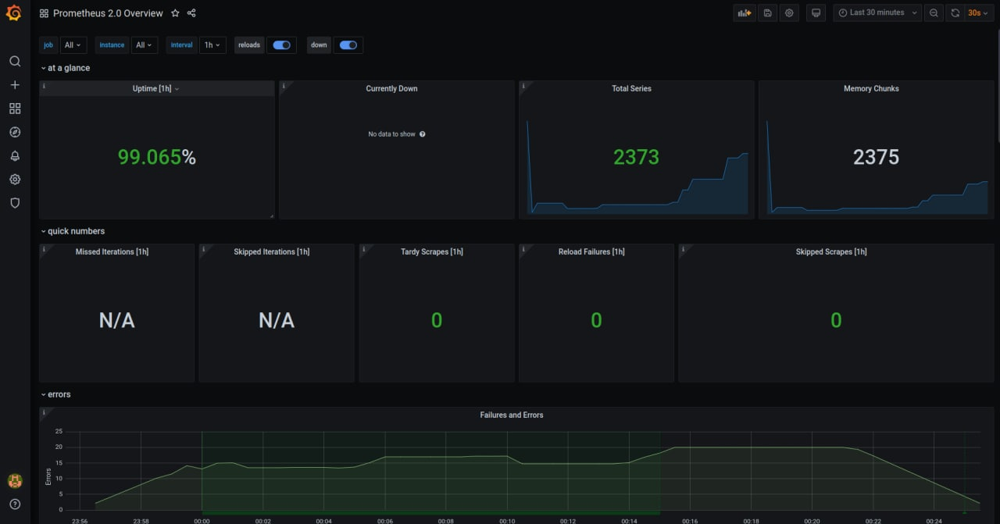
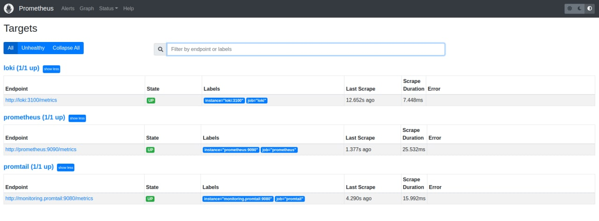

# Screenshots of obtained results

## Loki query execution. List of logs from time-python application:

## Loki 2.0 GLobal Metrics

## Prometheus 2.0 Overview

## Screenshots of Prometheus targets `localhost:9090/targets`:

