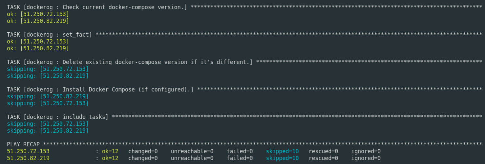
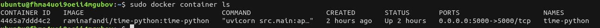

# Lab5 - Ansible Configuration

For the installing docker and configure it in VMs which made by terraform, ansible used. In ansible/inventory/hosts , hosts defined for the VMs.

## References for Roles:

https://github.com/geerlingguy/ansible-role-docker

## References for Playbooks:

https://docs.ansible.com/ansible/latest/user_guide/playbooks_intro.html
https://docs.ansible.com/ansible/2.5/scenario_guides/guide_docker.html#examples

For proving docker installed to server, connection made to a VM server via ssh:

## Lab6 - Ansible to Cloud

For the deploying app_python to Yandex Cloud, ansible, terraform, and docker hub used. Process is following:

1. Dockerized project put to the docker hub.
2. Terraform configured to deploy the project to Yandex Cloud.
3. Ansible configured to make commands for installing docker and pip to Yandex Cloud.
4. Dockerized project deployed pulled in Yandex Cloud VM and installed by ansible playbook/role.

Ansible Playbook:

Running Docker container in the VM:

Running application in the web browser:
http://51.250.6.229:5000

# Commands

    ansible-playbook playbooks/{file_name}
