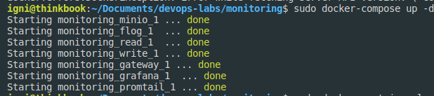
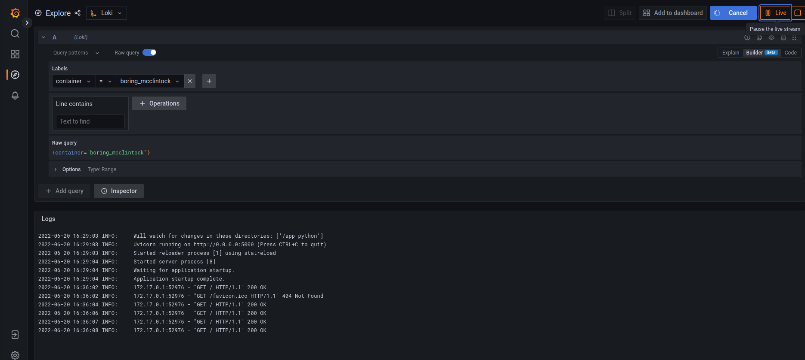

# Grafana/Loki Best Practices

1. Static labels - using host, application, environment labels are a good idea, it increases logical sense of the logs
2. Use dynamic labels sparingly - Making so many label combinations may cause performance issues.
3. Label values must always be bounded - Try not use labels which can have infinite value
4. Configure Caching- Loki can cache and it is improving performance.
5. Use chunk_target_size - Using chunk_target_size instructs Loki to try to fill all chunks to a target compressed size of 1.5MB. These larger chunks are more efficient for Loki to process.

# Screenshots

Docker compose up to make promtail/loki dashboard.

Screenshot from dashboard when the docker container of app_python run locally, logging in live mode.

