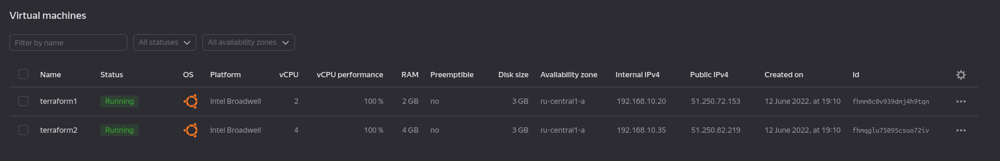

# Lab5 - VMs in Cloud

By using terraform, two new VMs created in yandex cloud provider.

    terraform validate
    terraform fmt
    terraform plan -var-file="secrets.tfvars"
    terraform apply out-terraform-vars
