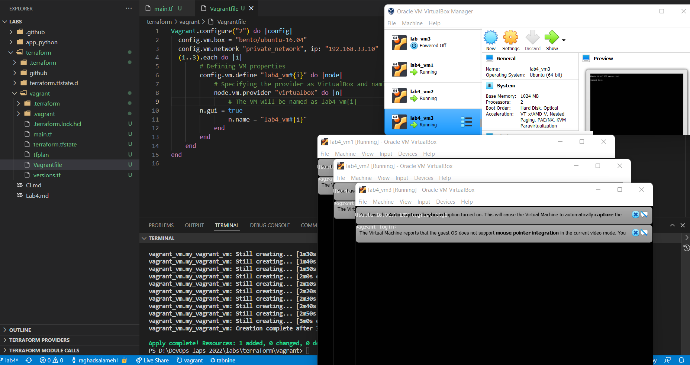
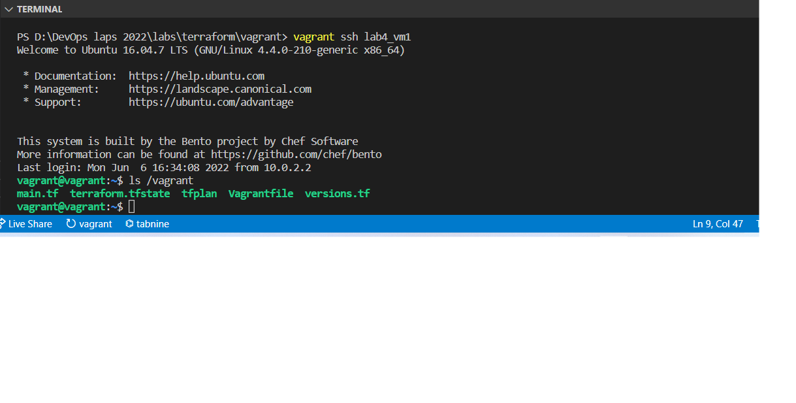
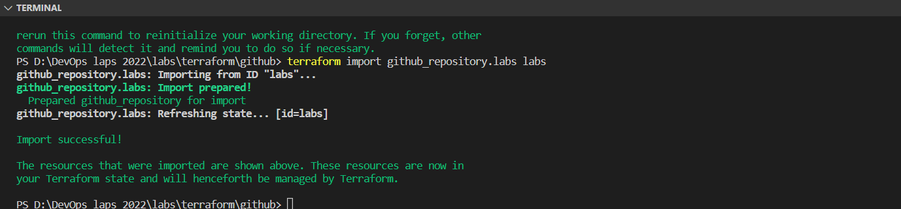
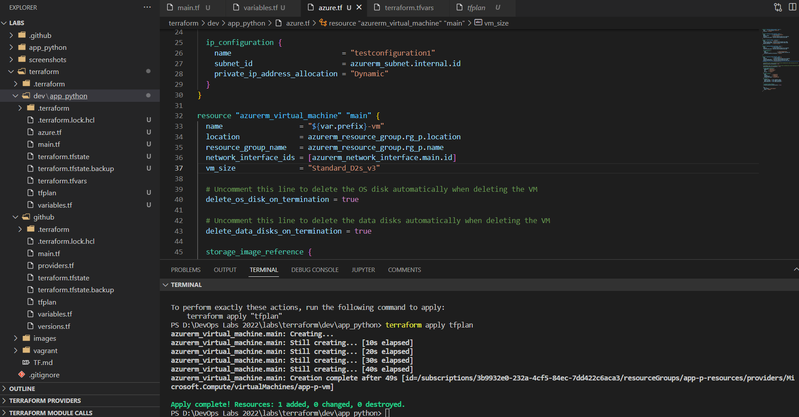
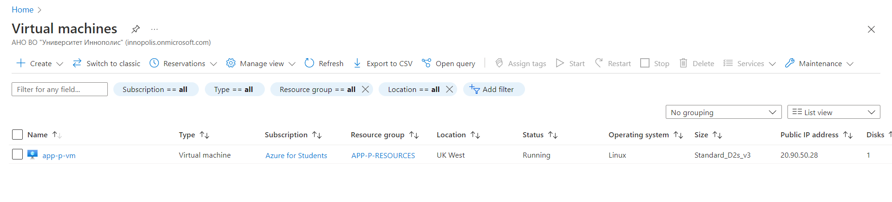

# Lab4

## Description of the best practices for Terraform

- Don't hardcode values that can be passed as variables or discovered using data sources.
- Practice a consistent structure and naming convention.
  - Use underscore instead of dash everywhere (in resource names, data source names, variable names, outputs, etc).
  - Prefer to use lowercase letters and numbers.
- Manipulate state file only through TF commands and not manually.
- Structuring your code as the folowing:
  - main.tf: contains locals, module and resource definitions;
  - variables.tf: contains declarations of variables (i.e. inputs/parameters) used in main.tf;
  - data.tf: contains data-resources for input data used in main.tf;
  - providers.tf: contains provider.
  - versions.tf: contains provider's version definitions.
  - terraform.tfvars: contains secrets and tokens.
- Add .tfvars to .gitignore file.
- Use modules where necessary.
- Set up a shared remote storage for statefile in case of working within team.
- locking the state file until writing to the file is completed to avoid incostency or crashing the state file when team concurently apply changes to the state.
- Backup the state file using versionning.
- using 1 state file per developing environment.
- Host terraform code on its own repository.

## Screenshot with 3 VMs

## Screenshot for Github

## Screenshot for Azure Virtual machine

