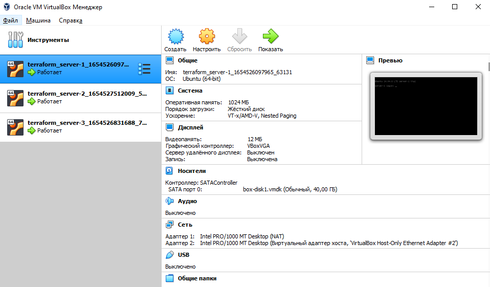
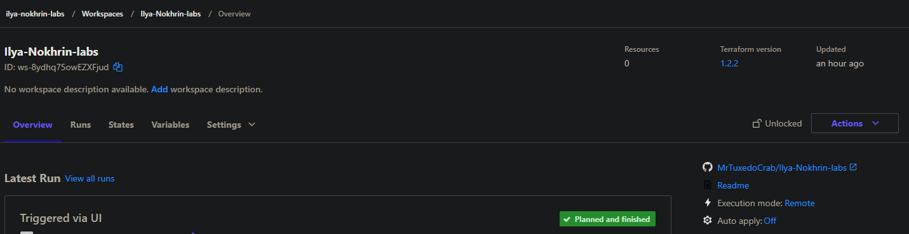
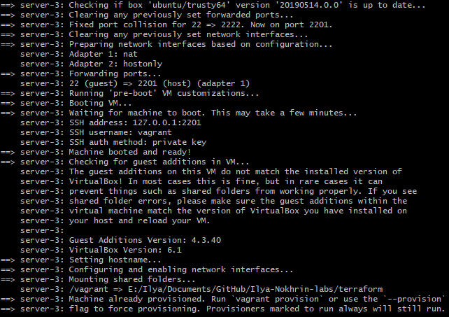
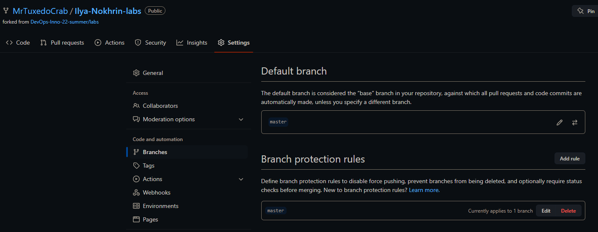

## Best practices for Terraform

- Dont't change terraform state file (.tfstate) manually, do this using "apply" command
- Set up a shared remote storage
- Backup state file
- Use 1 state file per Environment (test/dev/prod)
- Use CI for terraform code

## Screenshots

1. 3 VMs from VirtualBox

2. Workspace with GitHub repo in Terraform Cloud

3. Snippet from Vagrant console output

4. Default branch and protection rules

