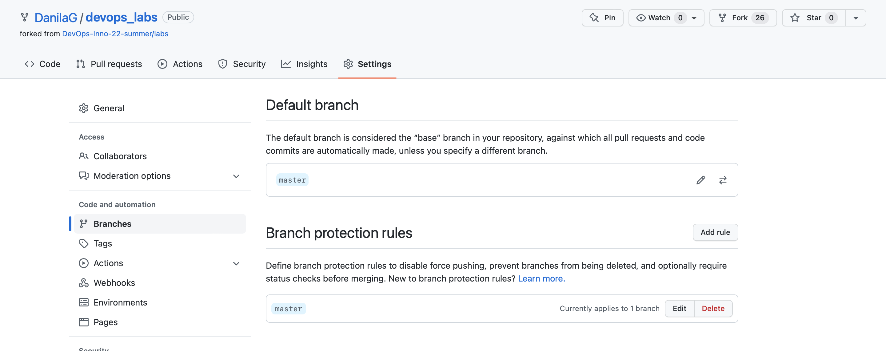
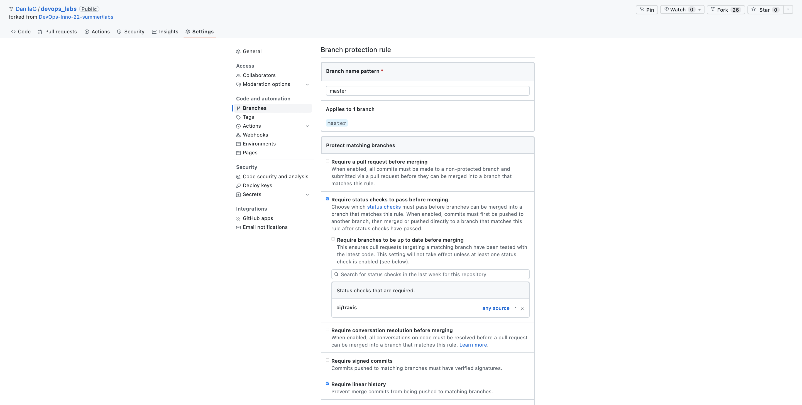
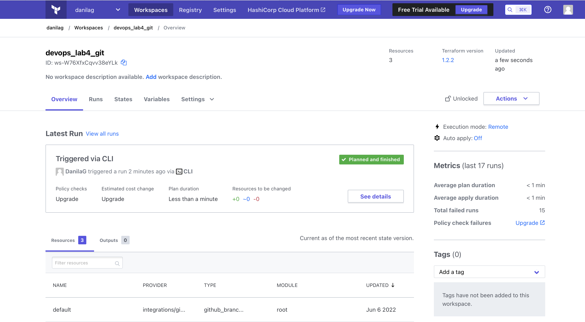
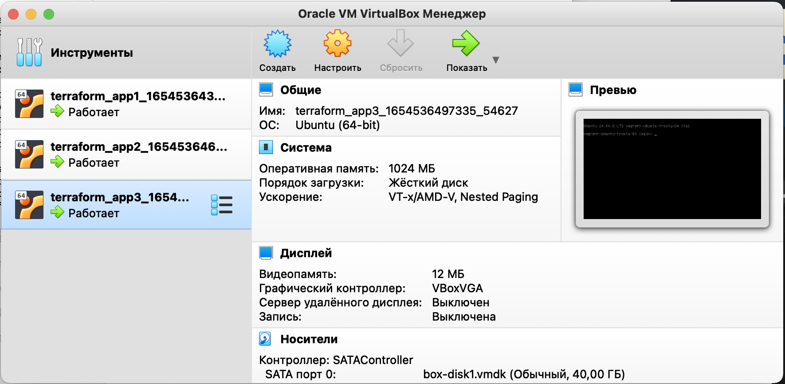

# Terraform

## Best practices

- Split the configuration into several files: main, variables, versions, output
- Use `terraform fmt`
- Use `terraform validate`
- Set up a shared remote storage
- Backup state file
- Use `terraform apply` for changing .tfstate

## Screenshot

### With default branch

### Branch protection rules

### Terraform workspace

### 3 VMs

