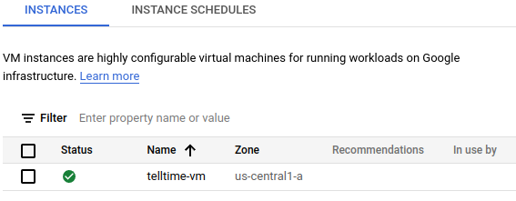
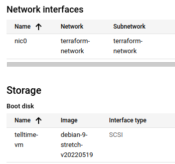
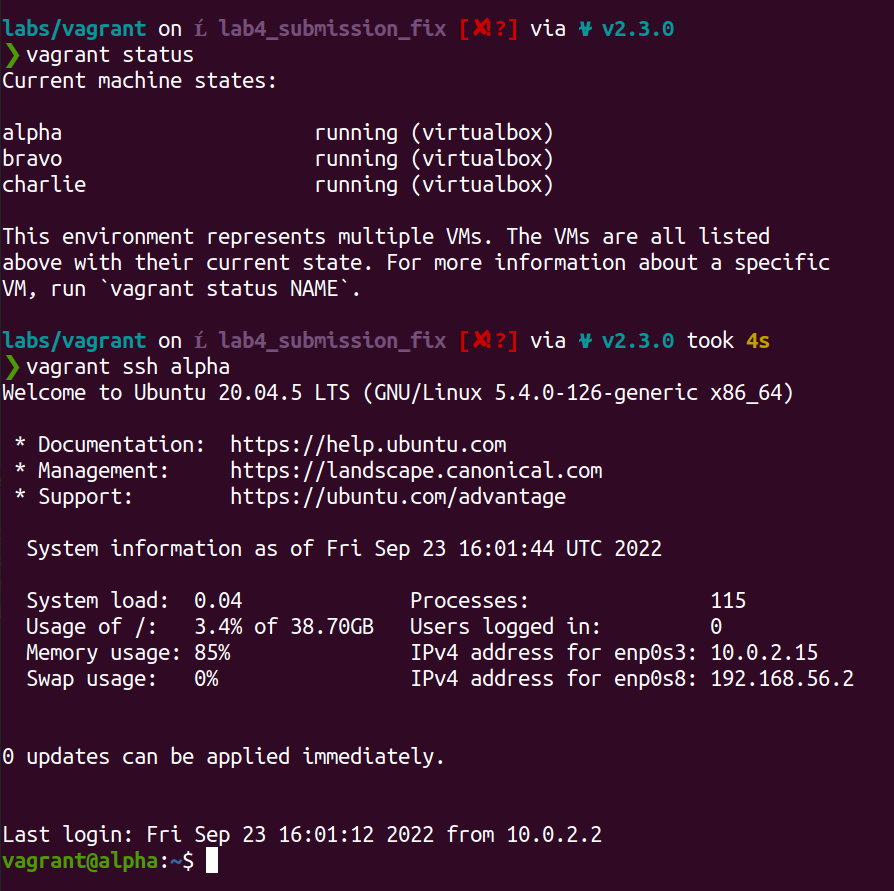
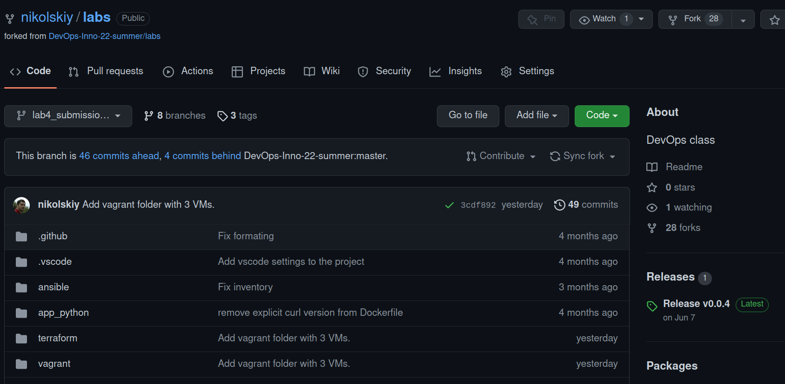
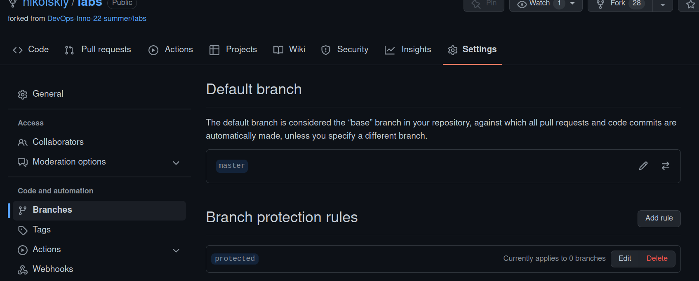

# Terraform

## Terraform Best practices

* Best [practices](https://cloud.google.com/docs/terraform/best-practices-for-terraform) from Google Cloud docs.
* Module [structure](https://www.terraform.io/language/modules/develop)
* Use `terraform import` to pull the current state of the resource before applying.
* Don't publish sensitive information

## References

* Manage github repo through [terraform config](https://learn.hashicorp.com/tutorials/terraform/github-user-teams)
* [Gitlab repo provider](https://registry.terraform.io/providers/gitlabhq/gitlab/latest/docs) (just in case)
* Terraform [variables](https://www.terraform.io/language/values/variables)

## GCP VM

After applying terraform VM was created:

Related resources were added as well:

## Vagrant

3 running VMs:

## Github repo synchronized

Main repo page:

Protected branch:

