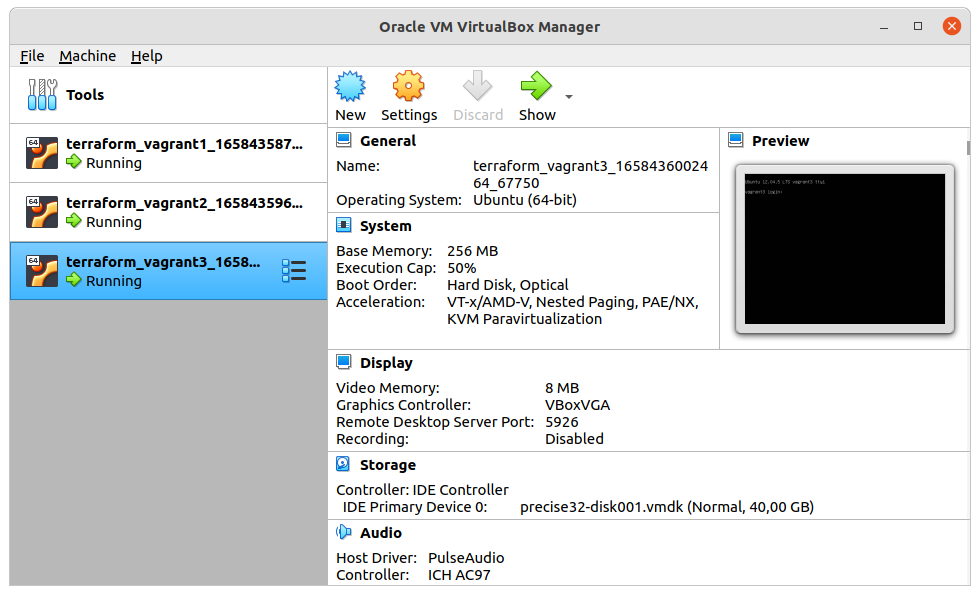
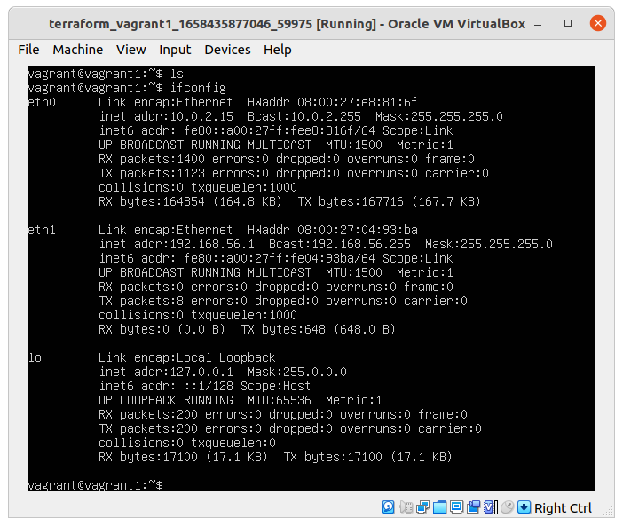
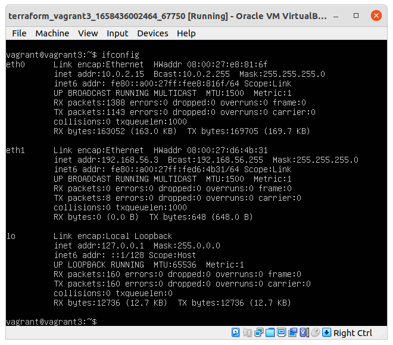
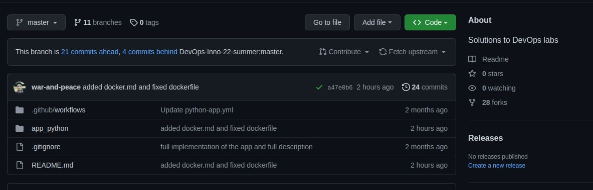
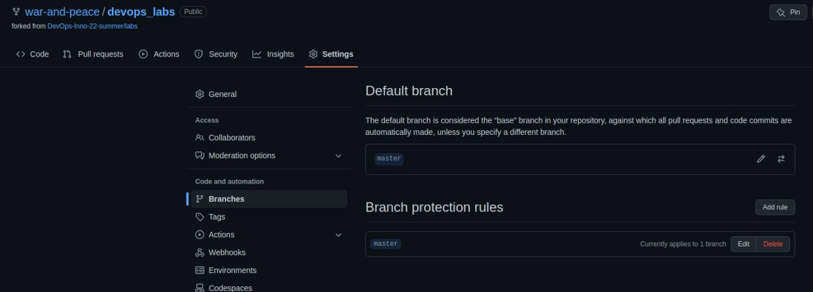

## Vagrantfile
Created vagrantfile for 3 instances

### Inside virtualbox:

### Screenshot of vagrant1 running:

### Screenshot of vagrant2 running:

### Screenshot of vagrant3 running:

## Terraform integration

### Best practices
 - Follow standard module structure with main.tf in every module
 - Adopt naming conventions
 - Declare all variables in variables.tf file
 - Use descriptions for variables
 - Use builtin formatting `terraform fmt`
 - Do not publish sensitive information

### Screenshot of Description change in github repo

### Screenshot of branch protection rule applied:
